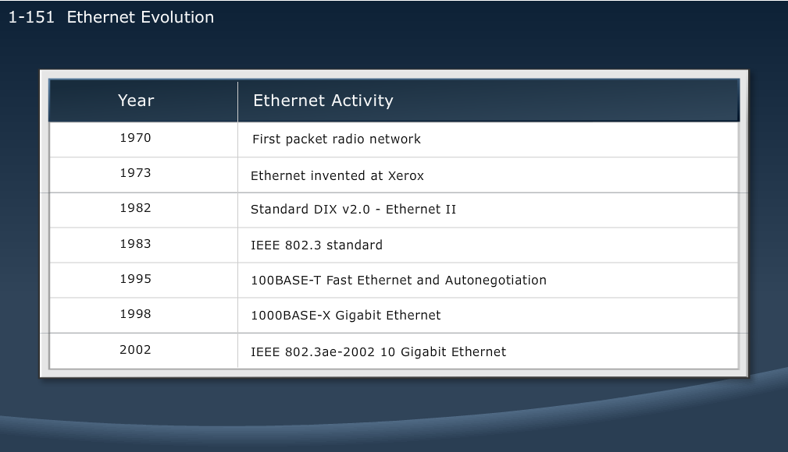

[List](index.html) | [Cisco LAN Switching](Cisco2.md)

# Networking Fundamentals and Concepts
-----------------------------------------

MODULE 1 LESSON 1
=================
Catalyst Switches
-----------------
	Low end switches
	Lots of similarities to higher end switches
	
Physical components
-------------------
	RJ-45
	NIC
	

	
> show ip interface brief - overview of ports

>Fa - Fast Ethernet
>Gi - Gigabit Ethernet
>Te - 10Gig Ethernet

### Rollover cable = Console Cable 
	really serial on both ends, just has RJ-45 on router end
	
VPN
---
	IPsec
	SSL or Web VPN - basically uses https technology
	
Network user applications
-------------------------
	Email
	Web browsing
	IM
	Collaboration
	Databases
	Mobile phone apps
	peer to peer - Skype, BitTorrent, Joost, etc
	Online Gaming
	
Impact of user applications on network
--------------------------------------
### 	Batch Applications
*		FTP, TFTP, inventory updates
*		No direct human interaction
*		Bandwidth is important, but not critical
		
### 	Interactive Applications
*		Inventory inquiries, database updates
*		Human to machine interaction
*		B/c human is waiting for a response, response time is important, but not critical, unless wait is too long
	
### 	Real-time Applications
*		VoIP, video
*		human to human interaction
*		Gaming
*		end to end latency is critical
		
Characteristics of network
--------------------------
*	Speed			measure of how fast data is transmitted - bps
*	Cost			indicates general cost of network components
*	Security		indicates how easily or difficult the network is to access as well as the data that is transmitted. 
*	Availability 	measure of the probability that the network will be available for use when it is required
					Calculated by dividing the uptime by total time in a year times 100
*	Scalability		how well the network can expand and accomodate more uses and data transfer requirements
*	Reliability		dependability of the network components, measured as probability of failure or mean time between failures (MTBF)
*	Topology 		Physical - arrangement of the cables, network devices, and end systems
					Logical - the path that the data signals take through the physical topology
					
Physical Topologies
-------------------
	Bus		All devices receive all signals
	
	Ring	Signals travel around a ring
			Multiple single points of failure
			
	Star	Transmission thru a central point
			Single point of failure
			
	Extended-Star	More scalable than star
					Most common
					
	Full Mesh		Highly fault tolerant
					Expensive
					
	Partial-Mesh	Trade off between redundancy and cost
	
	
Connections to internet
-----------------------
*	Wireless
*	Fiber
*	Copper
	

MODULE 1 LESSON 2
=================

### Security - always keep in mind no matter what you are doing on network

*Closed network - not connected to internet
*Open network - has connection to internet

Classes of attacks
------------------
	Passive		Traffic analysis, monitoring of unprotected communications, decrypting traffic, capturing authentication infomation
	Active		Attempts to circumvent or break protection features, introduce malicious code, steal or modify information
				Can result in disclosure of sensitive data, DoS, or modification of data
	Close-in	Ordinary individuals attaining close physical proximity to networks, systems, or facilities for modifying, gathering or denying access to data
	Insider		Can be malicious or non-malicious. Used for eavesdropping or snooping or can result from carlessness, lack of knowledge or lack of network security
	Distributed	Focus on malicious modification of hardware or software during distribution. Add a "back door" to the software or hardware.
	
Common threats
--------------
### 	Physical:
		Hardware threats
		Environmental threats
		Electrical threats
		Maintenance threats
### 	Reconnaissance:
		Learing information about target network by using available applications and information
### 	Access:
		Used to retrieve data
		Used to gain access
		Used to Escalate access privileges
### 	Password:
		Password crackers and guessers
		
Password Attack Threat Mitigation
---------------------------------
*	No default passwords
*	Do not allow users to use same password on multiple systems
*	Disable accounts after certain # of incorrect attempts
*	Do not use cleartext passwords
*	Use strong - non-dictionary passwords
	
>	sh run | include secret 
>	sh run | include password
>	login block-for 43200 attempts 10 within 90 - blocks all users for 1/2 day
	
	tomas - enable secret cracker - brute force
	tomas -cns <hash>
	

MODULE 1 LESSON 3
==================
Host-to-Host communications model
----------------------------------

### Try to adhere to Standardized model as much as possible

#OSI Model
7.	Application
6.	Presentation
5.	Session
4.	Transport
3.	Network
2.	Data Link
1.	Physical

### All People Seem To Need Data Processing
### Please Do Not Throw Sausage Pizza Away

### Why layered network?
*	Reduces complexity
*	Standardizes interfaces
*	Facilitates modular engineering
*	Ensures interoperable tehnology
*	Accelerates evolution
*	Simplifies teaching and learning

Layers
------
### Physical:
*	Binary Transmission - defines electrical, mechanical, procedural, and functional specs for activating, maintaining, and deactivating the physical link
						- Defines how we encode data for transmission
** 	Hubs, cables, terminators, jacks

### Data Link:
*	Access to Media 
	*	defines how data is formatted for transmission and how access to network is controlled
	*	Provides error detection
	*	Describes HOW we transmit data
	*	MAC Addresses, switches, 

### Network:
*	Data Delivery 
	*	Routes data packets, Provides error detection, Provides logical addressing and path selection
	*	Routers, routing enabled switches, IPv4/IPv6 addresses

### Transport:
*	End-to-End Connections 
	*	Handles transportation issues between hosts 
	*	Ensures data transport reliability
	*	Establishes, maintains, and terminates virtual circuits
	*	Provides reliability through fault detection and recovery information flow control
	*	UDP, TCP

### Sessions:
*	Interhost Communications 
	*	Establishes, manages, and terminates sessions between applications
	*	Allows multiple tabs for example
							
### Presentation:
*	Data Representation 
	*	Ensures that data is readable by receiving systems
	*	Formats & Structures data
	*	Negotiates data transfer syntax for application layer
	*	Provides encryption
	*	method for encoding audio, video (format), text formatting, image format

### Application
*	Network Processes to Applications 
	*	Provides network services to application processes (email, ftp, terminal emulation)
	*	Provides authentication
	*	API basically, developers' "hook" into the network stack
	

## Data Encapsulation

Start with user data. As it travels down the layers (starting from 7), each layer wraps the data with its own information. 

## De-Encapsulation

Each layer takes the info from its layer's header and remove it and send it to the next layer.

##Peer to Peer Communication
*	Physical Layer - Bits			Bacon		Birthdays
*	Data link Layer - Frames		Frying		Fear
*	Network Layer - Packets			Produces	People
*	Transport Layer - Segments		Salivation	Some
*	Session - Application Layers - Data

## TCP/IP Stack
### Application
	*	Represents data users
	*	Encodes & controls dialog
### Transport
	*	Supports communication between end devices across diverse network
### Internet
	*	Provides logical addressing and determines best path through network
### Network access
	*	Controls the hardware devices and media that make up the network

## TCP/IP OSI Comparison

## Summary

MODULE 1 LESSON 4
=================

## Internet Protocol Characteristics

*	Operates at layer 3 (Network Layer)
*	Connectionless protocol
*	Packets treated independently
*	Hierarchical addressing
*	Best-effort theory
*	No data-recovery features
*	Media-independent

# IP Addressing
* Connectionless Protocol
* 2 parts
	* Network ID - identifies the network that a host belongs to, used by routers to maintain info about routes
	* Host ID - identifies the individual host, assigned by organizations to individual devices
* IP Protocol Data Unit Header
	* 
* 4 8-bit octets
	* If 1st bit is 0, 1st octet has to be between 0 and 127
		* 127 is loopback (01111111)
	* 1st 2 bits are 10, 1st 2 octets have to be between 128-191
	* 1st 3 bits are 110, 1st 3 octets have to be between 192-223
	* 1st 4 bits are 1110, all octets are between 224-239
		* Multicast communication
	* 

## Public IP Ranges
* Class A
	* 1.0.0.0 to 9.255.255.255
	* 11.0.0.0 to 126.255.255.255
* Class B
	* 128.0.0.0 to 172.15.255.255
	* 172.32.0.0 to 191.255.255.255
* Class C
	* 192.0.0.0 to 192.167.255.255
	* 192.169.0.0 to 223.255.255.255
	
## Private IP Ranges
* Class A
	* 10.0.0.0 to 10.255.255.255
* Class B
	* 172.16.0.0 to 172.31.255.255
* Class C
	* 192.168.0.0 to 192.168.255.255
	
### DHCP
1. Broadcast/Discover
2. Offer
3. Request
4. Acknowledgement

### DNS
*	TCP/IP Suite Application Layer Protocol

MODULE 1 LESSON 5
=================

# Layer 4 - Transport layer
*	Session multiplexing
*	ID of different applications
*	Segmentation
*	Flow control (when required) - TCP only
*	Connection-oriented (when required) - TCP only
*	Reliability (when required) -TCP only

## TCP vs UDP
*	TCP is connection-oriented, UDP is Connectionless
*	TCP is reliable, UDP not
*	TCP uses sequencing, UDP does not
*	TCP uses:
	*	Email
	*	File Sharing
	*	Downloading
*	UDP uses:
	*	Audio/Video streaming
	*	TFTP
	*	Time-sensitive applications
	
### UDP Header

### TCP Header

# TCP/IP Application Layer Protocols
*	File transfer
	*	FTP
	*	TFTP
	*	NFS
*	Email
	*	SMTP
*	Remote Login
	*	Telnet
	*	rlogin
	*	ssh
*	Network Management
	*	SNMP
*	Name Management
	*	DNS
	
## Passing Network to Transport layer
*	Protocol ID field functions as pointer to transport layer
	*	TCP Protocol ID is 6
	*	UDP Protocol ID is 17

## Passing Transport to Application layer
*	
*	[Common port numbers](http://en.wikipedia.org/wiki/List_of_TCP_and_UDP_port_numbers)

## TCP Connection
*	3-way handshake
	1.	SYN (SEQ = 100 CTL = SYN)
	2.	Syn, ACK (SEQ = 300 ACK = 101 CTL = SYN, ACK)
	3.	ACK (SEQ = 101 ACK = 301 CTL = ACK)

*	Flow Control
	*	Client transmits
	*	Receiver sends stop request if buffer is full
	*	Client waits for Receiver to process data and send a resume signal
	*	Client resumes transmission

*	TCP Acknowledgement
	*	Window size is how many segments are sent before receiving an ACK
	*	TCP uses a sliding (or dynamic window)
		*	
		*	
		

MODULE 1 LESSON 6
=================

# Packet Delivery Process

## 1.	Layer 1 Devices
*	Ethernet
*	Serial
*	Repeaters/Hubs
*	Physical Inteface of NIC

## 2.	Layer 2 Devices
*	NIC
*	Bridge
*	Switch

###	Layer 2 Addressing
*	Transporting frame across media
*	MAC Address
*	Assigned end-to-end devices

## 3.	Layer 3 Devices and their function
*	Network layer provides connectivity and path selection between 2 hosts
*	In the host, this is the pat between the data-link layer and the upper layers
*	In the router, it is the actual path across the network.

###	Layer 3 Addressing
*	Must include identifiers that enable intermediary network devices to locate hosts on different networks
*	Each protocol stack has its own Layer3 format
	*	OSI uses NSAP
	*	TCP/IP uses IP

# ARP - Address Resolution Protocol
*	2 basic functions
		1.	Resolving IP Addresses to MAC Addresses
		2. 	Maintains a cache of mappings
*	ARP is not routable.. only works on LAN
	
### ARP Table
*	Keeps a record of recent bindings of IP Addresses to MAC Addresses
	 
# Host to Host Packet Delivery

S = Source - Layer 3: 192.168.3.1, Layer 2: 0800:0222:2222
D = Destination - Layer 3: 192.168.3.2, Layer 2: 0800:0222:1111

### Initial Phase

	1.	S-Application:		Network, can you set up a reliable connection to 192.168.3.2 for me?
	2.	S-Transport:		I'll use TCP
	3.	S-Transport:		Hey IP! Set up a session to 192.168.3.2
	4.	S-TCP:				Hey IP! Send this TCP SYN to 192.168.3.2

### ARP Request

	5.	S-IP:			Hey Layer 2! send this packet to 192.168.3.2
	6.	S-Layer 2:		ARP, do you have a mapping for 192.168.3.2
	7.	S-ARP:			Is 3.2 in ARP Table? No, Layer 2 will have to put the packet in the parking lot until I do an ARP
	8.	S-ARP:			ARP Request - I am 192.168.3.1, my MAC Address is 0800:0222:2222. Are you 192.168.3.2?
	9. 	S-ARP:			Layer 2, Send this using our MAC as the SRC MAC and a broadcast as the DST MAC.
	10.	S-Layer 2:		It is sent.
	11.	D-Layer 2:		I just got a frame w/ broadcast MAC so I'll process it. the protocol ID says that it belongs to ARP. Let me strip the Layer 2 header and send it to ARP
	12.	D-Layer 2:		ARP, here is something for you.
	13.	D-ARP:			I just got an ARP request from 192.168.3.1. Let me add its IP and MAC address to my ARP Table, now i can respond.

### ARP Response

	14.	D-ARP:		The ARP reply will say that I am 192.168.3.2 with a MAC Address of 0800:0222:1111
	15.	D-ARP:		Layer 2, send this using our MAC Address as SRC MAC and 0800:0222:2222 as the DST MAC.
	16.	D-Layer 2:	It is sent.
	17.	S-Layer 2:	I just got a frame w/ my MAC so I'll process it. The protocol ID says that it belongs to ARP. Let me strip the Layer 2 header and send it to ARP
	18.	S-Layer 2:	ARP, here is something for you.
	19.	S-ARP:		I just got an ARP reply from 192.168.3.2. Let me add its IP and MAC to my ARP table.
	20.	S-ARP:		Layer 2, I have 192.168.3.2 mapped to 0800:0222:1111

### TCP 3-way Handshake

	21.	S-Layer 2:	I can send out the pending frame
	22.	D-Layer 2:	I need to send a SYN ACK to the TCP SYN that I received
	23.	D-TCP:		Send this.
	24.	S-TCP:		Got the SYN ACK
	25.	S-TCP:		I neeed to let the other end know I got the SYN ACK to cmplete the session establishment

### Sending Data

	26.	S-TCP:			Ok, Application, I have your session set up.
	27.	S-Application:	OK, I'll send you some data.
	28.	S-Application:	Here is the data.
	29.	D-TCP:			Application, here is some data.
	30.	D-Application:	I need to send an ACK to the data that I received.

## Default Gateway

*	If the destination doesnt have the ARP request MAC on the same LAN, it sends the MAC up to the gateway to forward to the next LAN

 
MODULE 1 LESSON 7
=================

# Ethernet

### LAN Components

*	Computers
	*	PCs
	*	Servers
*	Interconnections
	*	NICs
	*	Media
*	Network devices
	*	Hubs
	*	Switches
	*	Routers
*	Protocols
	*	Ethernet
	*	IP
	*	ARP
	*	DHCP
	
SOHO - Small Office or Home Office

## LAN Standards

LLC Sublayer - Indicates the upper-layer protocols (IPv4, IPv6)
MAC Sublayer - Duplexing, MAC Addressing
IEEE 802.2 - Indicates the upper-layer protocols (IPv4, IPv6)

*	IEEE 802.3	- 	Type field is replaced by Length, and an 802.2 LLC header follows the 802.3 header
*	IEEE 802.3u	- 	100Mbps w/ autonegotiation
*	IEEE 802.3z	- 	Fiber at 1Gbps
*	IEEE 802.3ab- 	Twisted Pair at 1Gbps
*	IEEE 802.3ae- 	Fiber at 10Gps

## Ethernet Frame Structure

1. **Preamble:**			There is data to follow										7 bytes
2. **SOF:**					Start of Frame												1 byte
3. **Destination Address:**	Destination MAC Address										48 bits - 6 bytes
4. **Source Address:**		Source MAC Address											48 bits - 6 bytes
5. **Length:**				Size of frame												2 bytes
6. **802.2 Header & Data:**	LLC indication of the upper-layer protocols (IPv4, IPv6)	46-1500 bytes
7. **FCS:**					Frame Check Sequence										4 bytes

### Communications

*	Unicast - 1 to 1 communication when MAC address are known
	*	Telnet, FTP, HTTP, SNMP, SMTP, SSH, ARP Reply, DHCP Offer
*	Broadcast - Uses destination MAC address of FF-FF-FF-FF-FF-FF
	*	DHCP Discover, ARP Request, RIPv1
* 	Multicast - Uses special multicast MAC Address that members of a group listen on
	*	CDP, RIPv2, OSPF, EIGRP, VTP
	
## MAC Address compenents

1.	**Broadcast** - 1 Bit
2.	**Local** - 1 Bit
3.	**OUI** - 22 Bits
4. 	**Vendor Assigned** - 24 Bits

MODULE 1 LESSON 8
=================

# Connecting to an Ethernet LAN

### GBIC - Gigabit Interface Converter
	Normal or SFP (Small Form-Factor Pluggable)
	
### UTP - Unshielded Twisted Pair

*	100 Meter length max
*	

### STP - Shielded Twisted Pair

*	Provides metal mesh in outside insulation
*	Provides electrical interference resistance

### Optical-Fiber

*	Silica based glass
*	Single Mode & Multi Mode varieties
*	High speed & throughput
*	Low Cost
*	Small connector
*	Max length is longer than UTP or STP

### RJ - Registered Jack

**Straight-Through Cable**

**Crossover Cable**

### When to use...

*	When connecting "like-devices" together, use crossover
*	When connecting dissimilar devices together, use straight-through
*	Routers, PCs, servers, workstations, are all like devices b/c they function as spokes in the Ethernet hub-and-spoke topology
*	Switches and hubs are different type of "like-devices" b/c they function as hubs in Ethernet hub-and-spoke topology
*	Crossover
	*	hub-hub
	*	hub-switch
	*	switch-switch
	*	router-router
	*	PC-router
	*	PC-PC
*	Straight-Through
	*	router-switch
	*	PC-switch
	*	server-switch
	*	pc-hub
	*	server-hub
	

