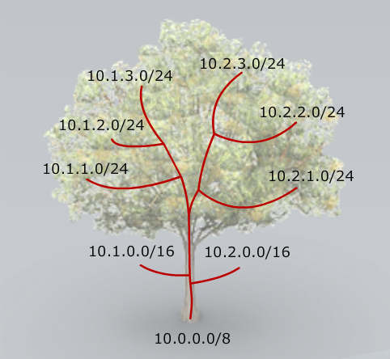
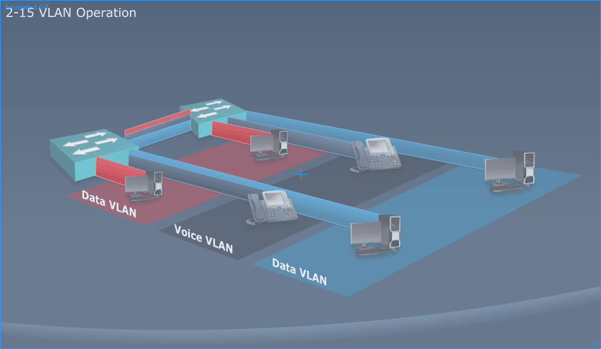
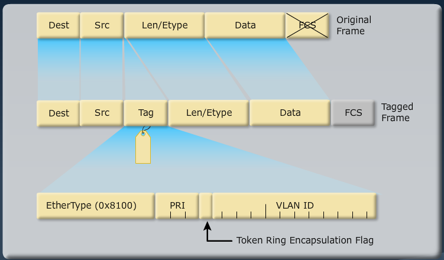
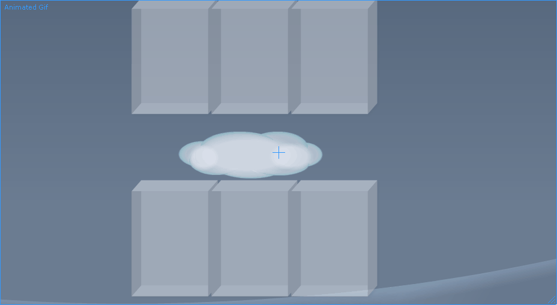
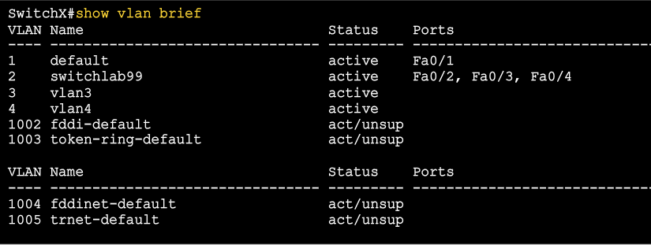
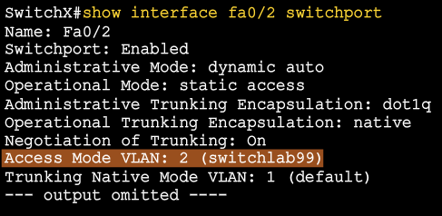
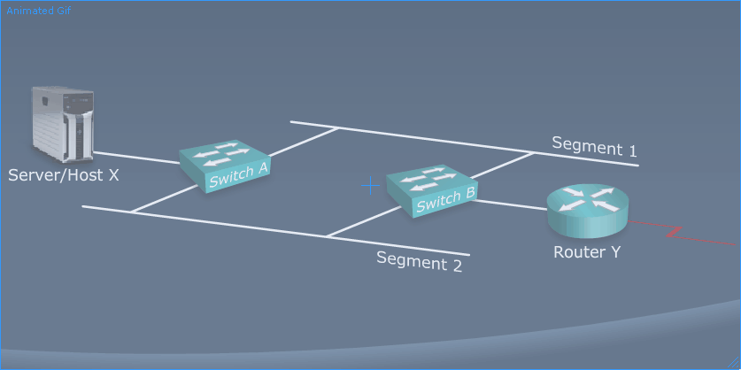

[Home](index.html)  |  [Spanning Tree](Cisco2-2.md)

Implementing VLANS
------------------------------

MODULE 1 LESSON 1
=================

Review
-------

1.	User Exec mode>					- Guest level access
2.	Privileged Exec mode#			- Privileged access
3.	Global Configuration(config)#	- System wide configuration
	*	(config-if)#
	*	(config-line)#
	*	(config-router)#

Common Commands
----------------
	banner-motd - Sets Message Of The Day
	configure terminal - enter global config mode
	erase startup-configuration - erase NVRAM config
	copy running-config startup-config - copies current configuration to NVRAM configuration
	enable - enter privileged exec
	enable secret *password* - Sets encrypted password to enter Privileged Exec
	hostname *name* - sets hostname of router
	interface *interface* - enters (config-if) for *interface*
	ip address *address mask* - sets ip address on interface
	ip default-gateway *address* - sets default gateway on device
	line console 0 - enters (config-line) for console 0
	line vty 0 4 - enters (config-line) for virtual lines 0-4
	login - configures line to require password on connecting
	password *password* - sets password for line
	reload - restart switch
	show cdp neighbors - list of directly connected Cisco devices that have cdp on
	show interfaces - displays info about all interfaces
	show port-security [interface address] - Displays secure ports on a switch
	show running-configuration - show current config
	show startup-configuration - show NVRAM config
	shutdown/no shutdown - enable/disable interface
	switchport mode access - sets switchport to access more
	switchport port-security - enables port security on interface
	switchport port-security mac-address *mac* - sets secure MAC address per port
	switchport port-security maximum *value* - only allows *value* number of devices per port

MODULE 1 LESSON 2
=================

Medium Sized Switched Network Construction
-------------------------------------------

# VLANS and Trunks

### Issues in poorly designed networks
*	Unbounded failure domains
*	Large broadcast domains
*	Large amount of unknown MAC unicast traffic
*	Unbounded multicast traffic
*	Management and support challenges
*	Possible security vulnerabilities

## VLAN Overview
*	VLAN is an independent LAN network
*	VLAN - Broadcast Domain = Logical Network (subnet)
*	VLANs address:
	*	segmentation
	*	security
	*	network flexibility
	
### Designing VLANS for an Organization
*	VLAN design must take into consideration the implementation of a hierarchical network addressing scheme.
*	Benefits of hierarchical addressing are:
	*	Ease of managment and troubleshooting
	*	Minimization of errors
	*	Reduced number of routing tables entries
*	

### Guidelines for Applying IP Address Space
1.	Allocate one IP subnet per VLAN
2.	Allocate IP address spaces in contiguous blocks (summarization)

## Network traffic types
*	Traffic types to consider when designating VLANs
	*	Network management
	*	IP telephony
	*	IP multicast
	*	Normal data
	*	Scavenger class
	
## Voice VLAN Essentials
*	VoIP traffic has special requirements (bandwidth, priority, small delay, etc.)
*	Use separate VLANs for IP telephony traffic and data traffic to avoid conclict - Voice VLAN
*	Cisco IP phones are often implemented with PoE

### Advantages of Voice VLANs
*	Segments phones in separate logical networks
*	Provides network segmentation and control
*	Allows administrators to create and enforce QoS
*	Allows administrators to add and enforce policies

**VLAN Operation**

### VLAN Membership Modes
*	Static VLAN
	*	Switch(config-if)#switchport mode access
	*	Switch(config-if)#switchport access vlan 5
*	Dynamic VLAN
	* 	Uses VLAN Management Policy Server (VMPS)
	*	Switch(config-if)#switchport mode access
	*	Switch(config-if)#switchport access vlan dynamic
*	Voice VLAN
	*	Switch(config-if)#switchport mode access
	*	Switch(config-if)#switchport access vlan 15
	*	Switch(config-if)#switchport voice vlan 55
	
## IEEE 802.1Q Trunking
*	Configured between switches & routers
*	Configured between routers & routers

### 802.1Q Frame
*	Modifies the Frame:
*	
*	Native VLANs contain all traffic not assigned to another VLAN
	*	Default Native VLAN is 1
	*	Native VLAN **Must** be the same on both ends of trunk
*	Native VLAN traffic frames are not tagged by 801.1Q Trunking

## VTP Features
*	VLAN Trunking Protocol
*	
*	Whatever VLAN info is configured on VTP server is propagated to all other switches

### VTP Modes
1.	Server - default mode
	*	Creates, modifies, and deletes VLANs
	*	Sends and forwards advertisements every 5 minutes
	*	Synchronizes VLAN configurations
2.	Client
	*	Cannot create, modify, or delete VLANs
	*	Sends and forwards advertisements every 5 minutes
	*	Synchronizes VLAN configurations
3.	Transparent
	*	Can create, modify, and delete VLANs, **but only locally** (does not synchronize changes)
	*	Forwards advertisements every 5 minutes
	
### VTP Operation
*	VTP advertisements are multicast frames
*	VTP servers and clients are synchronized with latest revision number
	*	every change increments revision number
*	VTP advertisements are sent every 5 minutes or when there is a change

### VTP Pruning
*	Off by default
*	All broadcast traffic goes down all trunk links
*	Pruning restricts broadcast traffic to trunks that are connected to switches with desired vlan

## Configuring VLANs and Trunks

### 802.1q Trunking Considerations
*	Make sure the native VLAN for an 802.1q trunk is the same on both ends of the trunk link.
*	Port security cannot be enabled on trunk ports
*	Protocol DTP (dynamic trunking protocol) manages trunk negotiations between Cisco switches

### Configuring Trunk Port
*	Enter interface configuration mode
*	configure FA0/11 int as a VLAN trunk
*	Native VLAN can be changed

**trunk config**

	Switch#configure terminal
	Switch(config)#interface fa0/11
	Switch(config-if)#switchport mode {access | dynamic {auto | desirable} | trunk}
	Switch(config-if)#switchport mode trunk
	Switch(config-if)#switchport trunk native vlan 99

	IF BOTH SIDES ARE DYNAMIC AUTO, THEY WILL NOT GO TO TRUNK

## VTP Configuration Guidelines
*	VTP defaults for Catalyst switches (show vtp status)
	*	VTP domain name: <Null> (once set, cannot be set back to null unless vtp db is deleted)
	*	VTP mode: Server mode
	*	VTP pruning: Enabled or disabled (model specific)
	*	VTP password: None
	*	VTP version: Version 1 - the line on vtp status shows highest version supported
	*	VTP V2 mode: Disabled - this shows whether using version 1 or 2
	*	Configuration Revision: 0
* 	A new switch can automatically become part of a domain once it receives advertisement from a server in the domain
*	**A VTP client can overwrite a VTP server database if the client has a higher revision number**

### Configuring VTP server and client

	switch(config)#vtp mode server
	switch(config)#vtp domain ICND
	switch(config)#vtp password cisco
	switch(config)#vtp pruning

	switch(config)#vtp mode client
	switch(config)#vtp domain ICND
	switch(config)#vtp password cisco

**Can change VTP domain name and mode at anytime**
*	Changing VTP domain name on 1 device *does not* propagate to others
*	If name change is desired, must change on all devices in the VTP Domain
*	Changing domain name resets Revision Number to 0
	*	which means changed device will not sync with other devices in previous domain

1. 	Client mode
	*	Cannot create, modify, or delete VLANS in client mode
	*	Client mode only listens and changes based on wheat server broadcasts
2.	Transparent mode
	*	Configuration Revision number is always at 0
	*	Can configure, modify, and delete VLANS in transparent mode
	*	Information changed is *NOT* propagated in transparent mode
	*	All changes only affect the local device

### IF YOU PLUG IN OLD SWITCH THAT HASN'T BEEN USED IN A WHILE, MAKE SURE CONFIGURATION REVISION NUMBER IS 0 OR IT WILL OVERWRITE YOUR VTP DOMAIN CONFIGURATION

## VLAN Creation Guidelines
*	Max number of VLANs is switch-dependent
*	Most Cisco Catalyst desktop switches support 128 separate spanning-tree instances, one per VLAN
*	VLAN 1 is the factory default Ethernet VLAN
*	CDP and VTP advertisements are sent untagged and by default on VLAN 1
*	The Cisco Catalyst switch IP address should be in the management VLAN
*	If using VTP, the switch must be in VTP server or transparent mode to add of delete VLANs

*Configuring a VLAN*

	Switch(config)#vlan 2
	Switch(config-if)#name descriptive_name

*Verifying a VLAN*

	Switch#show vlan id 2
	VLAN	Name			Status	Ports
	------- --------------- ------- ----------------
	2		switchlab99		active	Fa0/2, Fa0/12

## Assigning Ports to VLAN

	Switch(config)#interface range fa0/2-4
	Switch(config-if-range)#switchport access vlan 2 #assigns range to vlan
	Switch#show vlan #verifies vlan assignment

### Verifying VLAN Membership
*	show vlan brief
*	
*	show interface fa0/2 switchport
*	

## Executing Adds, Moves, and Changes for VLANS
*	When using VTP, the switch must be in VTP Server or transparent mode to add, change, or delete VLANs
*	When you make VLAN changes from a switch in server mode, the VLAN database is updated locally and propagated to other switches.
*	Changing VLANs typically inplies changing IP Networks.
*	After a port is reassigned to a new VLAN, that port is automatically removed from its previous VLAN
*	When you delete a VLAN, any ports in that VLAN that are not moved to another VLAN will not be able to communicate any longer.

### Summary
*	VLANs are independent LAN networks and address segmentation, security, and organizational flexibility
*	Ethernet trunks carry the traffic of multiple VLANs over a single link and allow you to extend VLANs across an entire network
*	VTP is a Layer 2 messaging protocol that maintains VLAN configuration consistancy.
*	To configure VLAN and trunking:
	*	configure trunking
	*	configure VTP (optional)
	*	create VLANs
	*	assign switch ports

MODULE 1 LESSON 2
=================

# Spanning Tree Protocol

## EtherChannel
*	Logical aggregation of similar links between switches
*	High bandwidth
*	Load-shares across links
*	Viewed as 1 logical port to STP (spanning tree protocol)
*	Redundancy - automatic failover
*	Can bundle up to 8 ports in etherchannel

### Redundant topology
*	Redundant topology eliminates single points of failure
*	Redundant topology can cause broadcast storms, multiple frame copies, and MAC address table instability problems
*	

### Broadcast Frames
*	Station D sends a broadcast frame.
*	Broadcst frames are flooded to all ports except the originating port.
*	**Broadcast Storms**
	*	Host D sends broadcst.
	*	Switches continue to propagate broadcast traffic over and over.
		*	 because switches receive broadcast on multiple ports so it never stops
		
### Multiple Frame Copies
*	Host X sends a unicast to router Y
*	Mac address of Router Y has not been learned by either switch
*	Switch A forwards frame out all ports (redundancy between A & B)
*	B receives 2 copies of frame and forwards out all ports except originating port
*	Router Y will receive 2 copies of the same frame
*	**Mac Address instability**
	*	Host X is on port 3 of Switch A
	*	Switch A has no entry for Router Y so floods frame out all ports (2 of which go to switch B)
	*	Switch B receives 2 copies of frame (puts Host X on port 2, then port 3)
	*	Forwards packets out all ports except originiating port
	*	Router Y gets instable MAC address table

