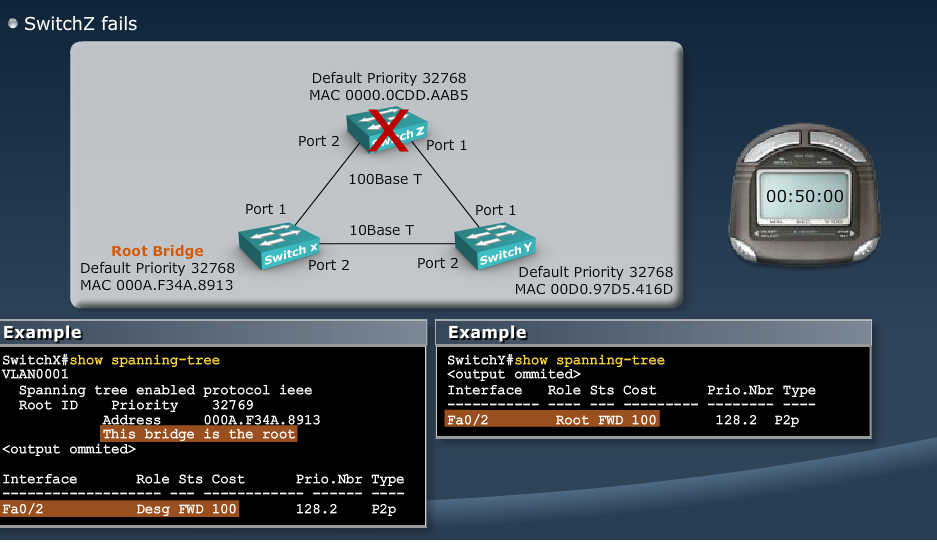
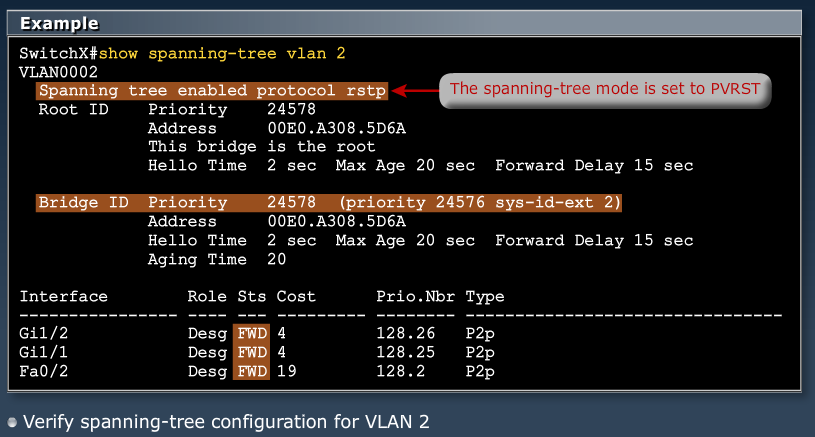
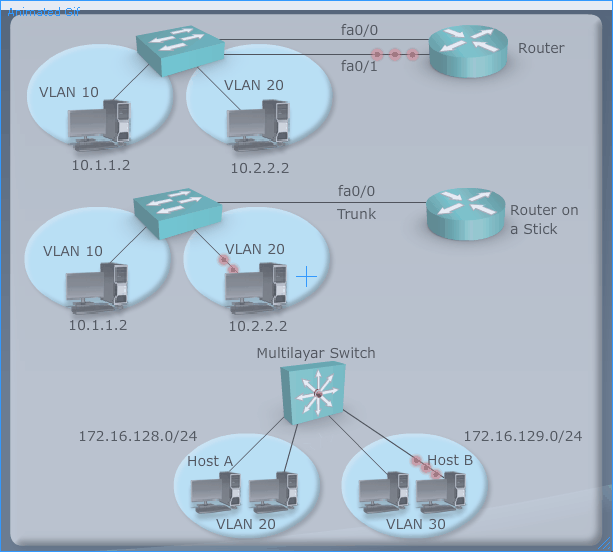

[VLANs](Cisco2-1.md)  |	[Home](index.html)  |  [Routing](Cisco2-3.md)

MODULE 2 LESSON 1
=================

# Optimizing Spanning Tree Protocol

## Loop resolution with STP
*	STP is a loop prevention protocol - detects loops and blocks ports when detected
*	Provides a loop free, redundant network topology by placing certain ports in the blocking state
*	Uses spanning tree algorithm
*	Published in the IEEE 802.1D spec

## Spanning-Tree Operation
*	STP executes an algorithm called spanning-tree algorithm
	*	Elects 1 root bridge per broadcast domain (subnet)
	*	Selects 1 root port per non-root bridge
	*	Selects 1 designated port per segment
	*	Block user traffic on nondesignated ports
	
### Root Bridge Selection
*	Exchange of BPDU (Bridge Protocol Data Unit) every 2 seconds
*	Root bridge = bridge with the *lowest bridge ID*
*	Bridge ID = **Bridge Priority**, then **MAC Address**

----
	show spanning-tree
		*	shows Root ID, and Bridge ID
----

### Spanning-Tree Path Cost
*	

### Spanning-Tree Port Transition
*	STP transits each port through several different states:
	*	**Blocking** - Listens for BPDUs but does not send any
		*	loss of BPDU detected - max age = 20 seconds
		*	Transition to Listening State
	*	**Listening** - Send and receive BPDUs to determine active topology.
		*	Selects root bridge, selects, root ports, selects designated ports - Link is up after this
		*	15 seconds - forward delay
		*	Transition to Learning
	*	**Learning** - Send and receive BPDUs and learn MAC Addresses
		*	Forward delay - 15 seconds
		*	Transition to Forwarding state
	*	**Forwarding** - Send and receive BPDUs, learn MAC Addresses, and forward data
		*	Link is fully functioning at this point
		
###	Spanning-Tree Operation
*	STP executes an algorithm called spanning-tree algorithm
	*	Elects 1 root bridge per broadcast domain (subnet)
	*	Selects 1 root port per non-root bridge
	*	Selects 1 designated port per segment
	*	Block user traffic on nondesignated ports
*	*Root bridge* - The root of the tree
*	*Broadcast Domain* - VLAN or subnet
*	*Root port* - Each nonroot bridge gets 1 and only 1 root port. This is the port with the lowest path cost back to root bridge. Root bridges NEVER have root ports.
*	*Designated port* - Each segment (collision domain) gets 1 and only 1 designated port. This is the port on the segment closest to the root bridge.
*	*Nondesignated port* - All other ports in the VLAN are blocked

*	

**Deciding root/designated port costs in case of tie**
1.	Lower Path Cost
2.	Lower Upstream Bridge ID
3.	Lower Sending Port ID

## Describing PortFast
*	Immediate transision to forwarding state
*	Configured ONLY on access ports
*	**Do not configure portfast on trunk ports**

### Configuring PortFast
	Switch#conf t
	Switch(config)#int fa0/1
	Switch(config-if)#spanning-tree portfast
		--Configures only on fa0/1
		--Can also use int range

	Switch#conf t
	Switch(config)#spanning-tree portfast default
		--Configures on all non-trunking interfaces

## Default Spanning-Tree Configurations
*	Cisco supports 3 types of STP
	1.	PVST+  - 802.1d
	2.	PVRST+ - 802.1w
	3.	MSTP
*	STP is enabled by default
*	The default STP for Cisco Catalyst switches is PVST+
	*	A separate STP instance for each VLAN
	*	1 root bridge for all VLANs
	*	No load sharing

### Per VLAN Spanning Tree Plus (PVST+)
*	
*	Uses Extended Bridge ID
	*	Reduces Bridge Priority from 16 to 4 bits
	*	Uses the last 12 bits for *Extended System ID*
	*	

### Spanning Tree Recalculation
*	Can take up to 50 seconds for recalculation in case of a switch failure
*	

## Rapid Spanning-Tree Protocol
*	Fast convergence (approx. 5 seconds)
*	Instead of putting port in blocked state, it marks as Alternate, so that it can switch to another path quickly

### PVRST+ Configuration Guidelines
1.	Enable PVRST+
2.	Designate and configure a switch to be the root bridge
3.	Designate and configure a switch to be the secondary root bridge (optional).
4.	Verify the configuration

### Configuring Root and Secondary Bridges
*
*

**Verifying**

## Summary - Lesson 2
*	A redundant switched topology includes multihorned switches and EtherChannel
*	A redundant switched topology causes looping issues
*	The 802.1d STP establishes a loop-free topology, where STP has been enhanced by PVST+, which runs spanning-tree instances per VLAN
*	Convergence in STP is a state in which all ports are either forwarding or blocking.
*	STP has been enhanced by RSTP which provides faster convergence
*	Guidelines for configuring PVRST+ include enabling PVRST+ and designating root and secondary bridges per VLAN

# Routing between VLANs
------------------------

## VLAN to VLAN Overview
*	Network layer devices combine multiple broadcast domains
	*	Without routing device, inter-VLAN traffic would not be possible
*	The following devices can provide inter-vlan routing:
	*	Any external router or group of routers with a separate int in each VLAN
	*	Any external router with an interface that supports trunking (router on a stick)
	*	Any multilayer switch
*

### Deviding Physical interface into subinterfaces
*	Physical interfaces can be divided into multiple logical subinterfaces
	*	

### Routing between VLANs
1.	Traffic from PC1 enters switch on VLAN1
	*	Sends to mac address of default gateway
2.	Crosses trunk to router, arriving on subinterface FA0/0.1 (VLAN1)
	*	Switch forwards based on Mac address
3.	Router determines that route to PC2 is through subinterface FA0/0.2
	*	Router uses connected routes in table to make routing decisions
4.	Crosses trunk to switch, arriving on VLAN2
5.	Switched to PC2.

**Configuration**

**Verification**

# Securing Layer 2 Environment
--------------------------------

## Recommended Practices: New Switch Equipment
*	Follow established organizational security policies
*	Secure Switch devices
	*	Secure switch access
	*	Secure switch protocols
	
## Recommended Practices: Switch Security
*	**Secure switch hardware**
*	Set system passwords
	*	enable password (plain text)/enable secret (encrypted)
*	Secure remote access
	*	Use SSH when possible
	*	Secure access via Telnet
		*	line vty 0 4
		*	password <password>
		*	login
	*	Disable HTTP, enable HTTPS
*	Configure System Warning banners
	*	banner motd # Authorized access only!!! #
	*	banner login # Authorized access only!!! #
*	Disable unneeded services
*	Use syslog if available
	*	logging <syslog server address>
	
### Securing Protocols
*	CDP - Trim and use only as needed.
	*	no cdp run
	*	no cdp enable
*	Secure STP
	*	spanning-tree portfast bpduguard default
*	Disable auto negotiation of trunk capabilities.
	*	switchport mode trunk
	*	switchport mode nonegotiate
*	Minimize physical port access
	*	Shut down ports that are not being used
*	Establish standard access-port configuratino for both used and unused ports
	*	shut down unused
	*	set port-security
	*	make sure in correct VLAN
	*	make sure in access mode

**CDP**
	
	Switch(config)#int gi 1/0/24
	Switch(config-if)#no cdp enable - shuts cdp down on interface
	Switch(config-if)#exit
	Switch(config)#no cdp run - shuts cdp down on whole switch

### Port Security
*	Port Security restricts ort access by MAC Address
	*	Dynamic (limit number of addresses)
	*	Static (static configuration of addresses)
	*	Combination (static + dynamic)
	*	Sticky - Makes permanent
	
### 802.1x Port-Based Authentication
*	Network access through the switch requires authentication
	*

# Troubleshooting
-------------------

### General Guidelines
*	Become familiar with normal switch operatin
*	Have an accurate physical and logical map of the network
*	Have a plan
*	DO NOT assume that it's working, VERIFY IT.
*	Correct cable type, category, length
	*	Cat5 for 100Mb/s
	*	Cat5e/6 for 1Gb/s
	*	Straight-through for unlike devices
	*	Crossover for like devices
	*	Max distance for copper Ethernet is 100meters
*	Cable plugged into right port
*	Make sure ports are up and not administratively down or in err state
*	Make sure duplex and speed are not mismatched

### VLANs and Trunks
*	Make sure local and peer VLANs match
*	Make sure local and peer trunk *modes* match - not auto-auto
*	Make sure VLAN corresponds with a unique IP Subnet
*	Does inter-VLAN traffic have a functional layer-3 process
	*	Make sure one VLAN has route to other

### VTP
*	Can you see VLAN deteails in the *show vlan* commmand output
*	Do switches exchange VTP info.
*	Does an inserted switch cause network problems?
	*	Make sure you didnt insert switch with higher revision numnber
*	Are all ports inactive after power cycle?
	1.	Temporarilly change VTP to transparent
	2.	Add VLAN to which the uplink port is assigned to the VLAN database
	3.	Change VTP mode back to client after the uplink port begins fowarding.
	
### Spanning-Tree
*	Verify STP port states to id root and blocked ports
	*	*show spanning-tree* - look for oddities
*	Identify bridging loop and restore connectivity quickly
	*	unplug redundant link to remove loop (worst case scenario)
*	Check STP log events
	*	Use privileged exec command *debug spanning-tree events* to enable STP debug info.
	*	Use global config command *logging buffered* to capture this debug info in the device buffers
	*	Send debug output to syslog device.
*	Verify root bridge selection and that RSTP is enabled.

