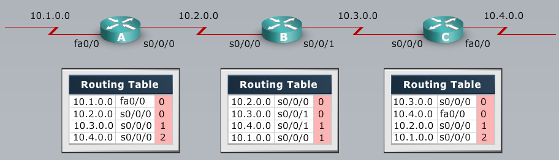

[Spanning Tree](Cisco2-2.md)  |	[Home](index.html)  |  [Dynamic Routing - OSPF](Cisco2-4.md)

# ROUTING
-------

# Medium Sized Routed Network Construction
-----------------------------------------

# Static vs. Dynamic Routes
*	**Static**
	*	Uses a route that a network admin manually enters
	*	Topology change requires a manual update
	*	Allows precise control over routing behavior
*	**Dynamic**
	*	Uses a route that a network routing protocol adjusts automaticlly for topology or traffic changes
	*	Router learns and maintains routes to the remote destinations by exchanging routing updates
	*	Routers are able to discover new networks by sharing routing table info

## Dynamic Routing Protocol
*	Routing protocols are a set of processes, algorithms, and messages that re used to exchange routing info
*	After directly connected routes have been installed, they populate the routing table with the routing protocol's choice of the best paths remote destinations
*	After the path is determined, a router can roure a routed protocol (like IP) to the learned networks

*	Discovers remote networks
*	Maintains up-to-date routing information
*	Chooses the vest path to destination
*	Find new best path if current path is no longer available
*	

### Autonomous Systems: Interior and Exterior Routing Protocols
*	An autonomous system is a collecion of networks withing a common administrative domain
*	Interior gateway protocols operate within an autonomous system
	*	RIPv2, EIGRP, OSPF
*	Exterior gateway protocols connect different autonomous systems
	*	BGP

## Classes of Routing Protocols
1.	Distance Vector (RIP)
	*	Distance (Hop Count)/Vector (Direction)
	*	Based on information provided by its neighbors (Routing by rumor)
	*	Exchanges complete routing table periodically (30 seconds by default)
	*	Bellman-Ford algorithm
2.	Link-State (OSPF, IS-IS)
	*	Establishes neighbor adjacencies
	*	Creates a topology map from LSAs
	*	Exchanges updates when a change occurs
	*	Dijkstra's Shortest Path First (SPF) algorithm
3.	Advanced Distance Vector (EIGRP)
	*	Combines aspects of Distance Vector and Link State
	*	Establishes neighbor adjacencies
	*	Exchanges updates when a change occurs
	*	Diffusing Update algorithm (DUAL)

###	Selecting the Best Route Using Metrics
*	A metric is a calculated value that is used to determine the best path to a destination
	*	

### Ranking routes
*	Routers choose the routing source with the best administrative distance
*	

### Distance Vector Routing Protocols
*	Routers pass periodic copies of their routing table to neighboring routers and accumulate distance vectors.
*	

### Sources of Informationand Discovering Routes
*	Routers discover the best path ot destinations from each neighbor
*	

### Maintaining Routing Information
*	Updates proceed step by step from router to router
	*	Topology change causes routing table update
	*	Router A Processes to update the routing table
	*	Router A sends out this updated table after the next period expires
	*	Router B Processes and updates their routing table
	*	etc, etc
*	If bad routes go in, bad routes go out (to the next router)

### Inconsistent Routing Entries: Counting to Infinity and Routing Loops
*	**Counting to Infinity**
*	Each node maintans the distance from itself to each possible destination network
*	
	*	Slow convergence produces inconsistent routing
	*	
	*	Router C path to 10.4.0.0 is down
	*	Router B's best route to 10.4.0.0 is through C
	*	Router B's time period expires before C's, so B sends routing table to C (B does not yet know the 10.4.0.0 network is down)
	*	Router C concludes that the best path to network 10.4.0.0 is through Router B
	*	Router C's update timer expired and sends out its routing table
	*	Now Router B updates its metric to 10.4.0.0 by 1, then sends its table to Router A
	*	Router A updates it's metric by 1.
	*	The metric will "count to infinity" because bad information is passed and propogated forever
	*	
	*	Count to Infinity default maximum is 16 hops
*	**Loops**
	*	Since B's best path to 10.4.0.0 is through C and C thinks the best path is through B,
	*	Packets for network 10.4.0.0 bounce between routers B and C
	*	TTL dictates when packet is dropped.
	*	*Solution: Split Horizon*
		*	Never send routing information in the direction that it came from.
	*	*Solution: Route Poisoning*
		*	Router with the failure (C in this case) will poison the metric of the down route (C will set route metric to 16)
	*	*Solution: Poison Reverse*
		*	Make sure to send the information back where it came from - (overrides split horizon)
	*	*Solution: Hold-Down Timers*
		*	After poison reverse, the previous router marks the route as "Possibly Down"
		*	Then sets hold-down timer and flush timer to allow other routers to recompute topology change
		*	
*	Triggered Updates:
	*	Router sends updates when a change in its routing information occurs
		
### Eliminating Routing Loops
*	
*	Router B sends triggered update to A and D when it discovers 10.4.0.0 is down
*	Update sets metric to 16
*	A and D set holddown timer and mark route as possibly down
*	A and D sends update to E and E sets holddown timer and mark route as possibly down
*	A and D send poison reverse to B, and E sends poison reverse to A and D
*	A, D, and E remain in hold-down state until:
	*	hold-down expires (if 10.4.0.0 is back up good to go)
	*	If not, wait 60 seconds for flush timer, and remove 10.4.0.0 from table
	*	If they get another route to 10.4.0.0, they will update table, and take that route
*	When link comes backup, B sends update to A and D, which sends to E
*	They see that metric was same as original, they keep it in "possibly down" until hold-down timer expires

## Link-State Routing Protocols
*	Complete view of network topology
*	Updates are sent when there is a link change
*	Associated with Shortest Path First (SPF) calculations
*	Use the link-state information to
	*	Create a topology map
	*	Select the best path to all destination networks in the topology
*	OSPF, IS-IS
*	*After initial flood of LSAs, link-state routers pass small, event-triggered link-state updates to all routers*

### Heirarchical Routing
*	Consists of areas and autonomous systems
*	Minimizes routing update traffic
*	

### Link-State Routing Algorithms
*	Path derived from *Cost*
	*	Takes speed of link and hops to determine cost

### Benefits of Link-State
*	Fast convergence: Changes are reported immediately by affected source
*	Robustness against routing loops:
	*	Routers know whole topology
	*	Lin-state packets are sequenced and acknowledged
*	Hierarchical network design enables optimization of resources

### Drawbacks of Link-State
*	Significant demands for resources
	*	Memory (3 tables: adjacency, topology, forwarding)
	*	CPU (Dijkstra's algorithm can be intensive, esp. when there are many instabilities)
*	Requires very strict network design
*	Configuration can be complex when tuning various parameters and when design is complex

MODULE 3 LESSON 2
-------------------

# Implementing VLSM
--------------------

# Subnetting Review
*	Subnetting allows you to create multiple logical networks from a single address block
*	To identify subnets, you "borrow" bits from the host ID portion of the IP address:
	*	The number of subnets available = 2s, in which s is the number of bits borrowed
	*	The number of hosts available -2h-2, in which h is the number of host ID bits not borrowed.
		*	1 address is network address - Host portion is all 0s in binary
		*	1 address is broadcast address - Host portion is all 1s in binary

## Subnet example
**Subnet 192.168.1.0 to support 8 subnets**

*	How many bits will we need to borrow?
	*	2s = 23 = 8 subnets (s=3 bits)
*	What is the new subnet mask?
	*	Borrowing 3 host bits = 24+3 = /27 or 255.255.255.224
*	What are the first 4 subnets?
	*	Figure out block size
		*	256 - significant octet (224 in this case) = 32 (block size)
	*	192.168.1.0, 192.168.1.32, 192.168.1.64, 192.168.1.96
*	How many host addresses are in each subnet?
	*	2h - 2 = 25 (8-s) -2 = 30 host addresses
*	What is the range of host addresses for the 1st 4 subnets?
	*	Can't use 1st or last address in subnet
	*	192.168.1.1-30, 192.168.1.33-62, 192.168.1.65-94, 192.168.1.97-126

# Variable-Length Subnet Mask
*	VLSM - Subnetting a subnet for efficient use of IP Addresses
*	Subnet 192.168.1.0/24 is divided into smaller subnets:
	*	Subnet with 1 mask (/27)
	*	Further subnet one of the unused /27 subnets into multiple /30 subnets
	
## VLSM Example
**172.16.32.0/20 Subnet. Make sure you can support 50 hosts per subnet**

*	
*	
*	
*	

## Route Summarization
*	
*	Both routers have big routing tables
*	Routing tables *can* be optimized
*	Routing protocols can summarize the addresses of several networks into 1 address
	*	

### Summarizing Within an Octet (option 1: counting bits)
1.	Step 1: Convert to Binary
	*	
2.	Step 2: Count number of common bits
	*		
3.	Step 3: Use the new common bits as the subnet mask and append it to the very first address in the block
	*	

### Summarizing Within an Octet (option 2: Counting subnets)
1.	Step 1: Count number of subnets
	*	
2.	Step 2:	Find power of 2 that gives you the value from step 1
	*	
3.	Step 3:	Subtract value from step 2 from the original subnet mask
	*	
4.	Step 4: Append the new subent mask to the first IP address.
	*	
	
### Summarizing Addresses in a VLSM-Designed Network
*	
*	On Router D:
	*	(config)#interface fa0/0
	*	(config-if)#ip summary-address eigrp 100 172.16.172.0 255.255.252.0
*	On Router A:
	*	(config)#interface serial 0/0/0
	*	(config-if)#ip summary-address eigrp 100 172.16.168.0 255.255.248.0
	
### Route Summarization in Cisco
*	Supports host-specific routes, blocks of networks, and default routes
*	Routers use longest prefix match

##	Classful Routing Essentials
*	Classful routing protocols do not include the subnet mask with the network in the routing advertisement
*	Within the same network, consistency of the subnet mask is assumed, so one subnet mask is assumed for the entire network.
*	Summary routes are exchanged between foreign networks
*	Examples of classful routing protocols:
	*	RIPv1
	*	IGRP

## Classless Routing Essentials
*	Classless interdomain routing (CIDR):
	*	More efficient use of IPv4 address space
	*	Route summarization
*	CIDR requires subnet mask to be included in routing update because address is class is meaningless-classless routing protocols
*	Classless routing protocols support VLSM; one network can have multiple masks
*	Summary routes must be manually controlled within the network
*	Examples of classless routing protocols
	*	RIPv2
	*	EIGRP
	*	OSPF

## Summarizing Routes in a Discontiguous Network
*	Classful RIPv1 & IGRP do not advertise subnets and therefore cannot support discontiguous subnets
*	Classless OSPF, EIGRP, & RIPv2 can advertise subnets and therefore can support discontiguous subnets
	*	RIPv2 & EIGRP act classful by default, and summary routes are exchanged between foreign networks.
	*	The **no auto-summary** command forces these protocols to behave as if they were classless.

	
