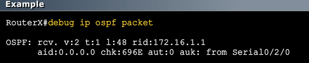

[Routing](Cisco2-3.md)  |	[Home](index.html)  | [Dynamic Routing - EIGRP](Cisco2-5.md)

MODULE 4 LESSON 1
=================

# Implementing OSPF
-------

## OSPF Essentials
*	Follwos open standard developed by IETF
*	Uses classless link-state protocols
*	Creates a neighbor relationship by exchanging hello packets
*	Propagates LSAs rather than routing table updates
	*	Link: router interface
	*	State: description of an interface and its relationship to neighboring routers
*	Floods LSAs to all OSPF routers in the area, not just directly connected routers
*	Pieces together all the LSAs generated by the OSPF routers to create the OSPF link-state database
*	Uses the SPF algorithm (Dijkstra) to calculate the shortest path to each destination and places it in the routing table
*	

### OSPF Hierarchy Example
*	Divides network into areas for scalability
*	Minimizes routing table entries
*	Localizes the impact of a topology change within an area
*	

### Neighbor Adjacencies: Hello Protocol
*	OSPF Hello Packets are sent every 10 seconds on a multicast 224.00.0.0 address and point-to-point serial links.
*	Information in Hello Packets:
	1.	Router ID: 32 bit number that IDs the router. Higher is better and loopback wins.
	2.	Hello and dead intervals:
		*	Hello interval specifies how often hello packet is sent.
		*	Dead interval specifies how long a router waits until it considers its neighbor dead
	3.	Neighbors: Lists adjacent routers with established bidirectional communication
	4.	Area ID: Specifies are number and it MUST match for a neighborship to form
	5.	Router Priority: 8 bit number that indicates the priority of the router for DR (Designated Router) and BDR (Backup Designated Router) elections
	6.	DR IP address: IP address of DR in a multiaccess network
	7.	BDR IP address: IP address of BDR in a multiaccess network
	8.	Authentication: Not required, but when enabled, both routers need to agree on the same password or a neighborship will not form
	9.	Stub area flag:	Special OSPF area that reduces routing updates by replacing them with a default route.
**NOTE: Hello and dead intervals, Area IDs, Authentication, and Stub area flag must match on routers for a neighborship to form!**

### DR and BDR in Multi-access (ethernet) networks 
*	This generally applies to LAN technologies like Ethernet
*	DR and BDR selection are required.
*	All neighbor routers form adjacencies with the DR and BDR only.
*	Packets to the DR and BDR use 224.0.0.6
*	Packets from the DR to all other routers use 224.0.0.5

### SPF Algorithm
*	Dijkstra's shortest path first algorithm
*	Cost = Reference bandwidth/interface bandwidth (b/s)
	*	Cost:
		*	Default cost of 100Mbps link = 1
		*	Default cost of 10Mbps link = 10
		*	Default cost of T1 = 64
	*	Reference bandwidth:
		*	Default is 108 which is 100,000,000 which is equal to the speed of a FA link of 100Mbps.
		*	This is problematic when you have links faster than 100Mbps.
		*	To adjust the reference bandwidth for faster links, use the *ospf-auto-cost reference-bandwidth* command
	*	Interface bandwidth:
		*	Bandwidth can be changed with the *bandwidth* command in config-if mode and can be viewed with the *sh int* command
		*	It is the value beside the BW in the output.
*	Places each router at the root of a tree and calculates the shortest path to each destination based on the cumulative cost
	*	
	
----
	R1#show ip protocols
	R1#show ip interface brief
	R1#conf t
	R1(config)#router ospf 1
	R1(config-router)#network 10.1.12.1 0.0.0.0 area 0 (ip of Gi1/0 and wildcard mask)
	R1(config-router)#network 11.11.128.0 0.0.3.255 area 0
---
	R2#show ip protocols
	R2#show ip interface brief
	R2#conf t
	R2(config)#router ospf 1
	R2(config-router)#network 10.1.12.2 0.0.0.0 area 0 
	R2(config-router)#network 10.1.234.2 0.0.0.0 area 0
---
	R3#show ip protocols
	R3#show ip interface brief
	R3#conf t
	R3(config)#router ospf 1
	R3(config-router)#network 10.1.234.3 0.0.0.0 area 0
---
	R4#show ip protocols
	R4#show ip interface brief
	R4#conf t
	R4(config)#router ospf 1
	R3(config-router)#network 10.1.234.5 0.0.0.0 area 0
	R4(config-router)#network 10.1.45.0 0.0.0.0 area 0
---
	R5#show ip protocols
	R5#show ip interface brief
	R5#conf t
	R5(config)#router ospf 1
	R5(config-router)#network 10.1.35.5 0.0.0.0 area 0
	R5(config-router)#network 10.1.45.5 0.0.0.0 area 0
	R5(config-router)#network 172.16.32.0 0.0.7.255 area 0

# Verifying OSPF
------------------

## OSPF Router ID
*	Number (IP Address) by which the router is known to OSPF
*	Default: the highest IP address on an active interface at the moment of OSPF process startup
*	Can be overridden by a loopback interface: highest IP address of any active loopback interface
*	Can be set manually by using the *router-id* command
**Higer is better, but loopback always wins!** (unless statically set with *router-id*)

### Verifying OSPF Config
*	**show ip protocols**
	*	Routing Protocol is "ospf 100" - Process id does not have to match
	*	Router ID - 32 bit number that identifies the router ot the ospf process
	*	Number of areas - local router information
	*	Maximum path - # of equal cost patch ospf can load balance over (default is 4)
	*	Routing for Networks - indicates which networks will be advertised in ospf updates
	*	Routing Information Sources - indicates where and when you received ospf updates from
	*	Distance - Administrative distance (default is 110)
*	**show ip route**
	*	Codes: shows codes for type of route
	*	O - OSPF route learned inside of our area
	*	172.16.1.0 *destination network* [110*administrative distance*/65*metric or cost*] via 10.1.1.1*next hop router*, 00:03:03*last updated time*, Serial0/2/0*local interface*
*	**show ip ospf**
	*	Routing Process "ospf 100"*process id* with ID 172.16.17.5*router id*
	*	Number of areas in this router is 1. 1 normal 0 stub 0 nssa
	*	Area BACKBONE(0)
		*	Number of interfaces in this area is 2
		*	Area has no authentication
		*	SPF algorithm executed 2 times
*	**show ip ospf interface [interface]**
	*	Internet address is 10.1.1.2/24, Area 0 - Logical interface
	*	Process ID - process id of ospf
	*	Hello due in 00:00:04 - number of seconds until hext hello packet is sent on this interface
	*	Adjacent with neighbor 172.16.1.1 - address of neighbor
*	**show ip ospf neighbor**

| 	Neighbor ID		|  Pri	|	State	|	Dead Time	|  Address	|	Interface	|
| ----------------- |:-----:|:---------:|:-------------:|:---------:|:-------------:|
|	192.168.1.1		|	0	|	FULL/-	|	00:00:37	|  10.2.2.3	|	Serial0/3/0	|
|	172.16.1.1		|	0	|	FULL/-	|	00:00:39	|  10.1.1.1	|	Serial0/2/0	|

*	**show ip ospf neighbor [neighbor ip]**
	*	Displays information on the specific neighbor
	
### OSPF Debug Commands
*	**debug ip ospf hello**
	*	
*	**debug ip ospf packet**
	*	
*	**undebug all**
	*	disables all possible debugging

### Load Balancing w/ OSPF
*	Paths must be equal cost
	*	Can be manually modified using *ip ospf cost* command
*	By default, 4 equal-cost paths can be placed into the routing table.
*	Maximum number of paths is platform dependent
*	Configure OSPF for maximum of 6 paths
	*	*RouterX(config-router)#maximum-paths 6*
*	Disable the OSPF load balancing
	*	*RouterX(config-router)#maximum-paths 1*
*	

### OSPF Authentication
*	OSPF supports the following types of authentication:
	*	Null (no authentication)
	*	Plaintext (or simple) password authentication
	*	MD5 authentication
*	The router generates and checks every OSPF packet
*	The router authenticates the source of each routing update packet that it receives
*	Configure a "key" (password); each participating neighbor must have the same key

---
	#configure password <password> for use with neighboring routers
	ip ospf authentication-key <password> 
	#configure authentication type for an interface
	ip ospf authentication [Message-digest | null | <cr>] 
	# configure authentication type for an area-id
	area <area-id> authentication [message-digest | <cr>] 

*	Plaintext Password Authentication Configuration Example
*	
*	*show ip ospf neighbor* To verify that you have neighbors.
	*	if neighbors are gone, authentication is likely not working.

### Configuring OSPF Default Route
*	The first command allows the ASBR to originiate a default route if it has the gateway of last resort.
*	The second command allows the ASBR to originate a default route even if there is no gateway of last resort. (optional)

---
	ASBR(config-router)#default-information originate
	ASBR(config-router)#default-information originate always

MODULE 4 LESSON 2
=================
	
# Components of Troubleshooting OSPF

### Troubleshooting OSPF Neighbor Adjacencies
1.	Make sure interfaces are in up up status
	*	
2.	Is OSPF enabled on the interface
	*	
3.	Is neighbor configured correctly?
	*	
4.	Does all required hello packet information match neighbor?
	*	

### Troubleshooting OSPF Authentication
1.	Is OSPF Authentication configured on the proper interface?
	*	
2.	Are passwords configured properly?
	*	
	
### Troubleshooting OSPF Routing Table Issues
1.	Are all required OSPF networks being advertised?
	*	
2.	Is OSPF neighbor up and sending routes?
	*	
