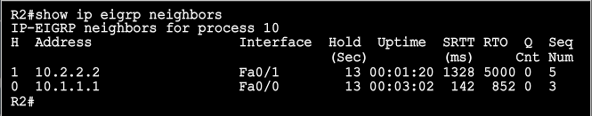
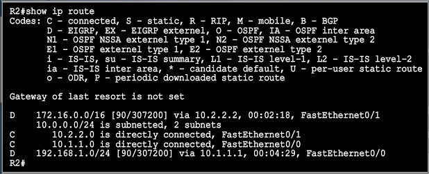

[Dynamic Routing - OSPF](Cisco2-4.md)  |	[Home](index.html)  | [ACLs](Cisco2-6.md)

MODULE 5 LESSON 1
=================

# EIGRP
---------

# Implementing EIGRP

## EIGRP Features
*	Advanced distance vector
	*	Hybrid of distance vector/link state
*	Rapid convergence
	*	Dual algorithms
*	100% loop-free classless routing
*	Easy configuration
*	Incremental partial bounded updates
*	Load balanancing whether costs are equal or not
*	Flexible network design
*	Support for multiple network-layer protocols
*	Multicast and Unicast instead of broadcast address
	*	224.0.0.10
*	Support for VLSM and discontiguous subnets
	*	*no auto-summary*
*	Manual summarization at any point in the internetwork

### EIGRP Tables
*	IP EIGRP Neighbor Table
	*	List of directly connected routers running EIGRP
	*	Next-Hop Router | Interface
	*	
*	IP EIGRP Topology Table
	*	List of all routes learned from each EIGRP neighbor
	*	Destination 1
	*	
*	IP Routing Table
	*	List of all best routes from EIGRP topology table and the other routing processes
	*	Destination 1
	*	

## EIGRP Path Calculation (Router C)

### EIGRP Configuration
*	Enabled EIGRP routing process for Autonomous System (100 in below example) **MUST MATCH**
	*	*router eigrp 100*
*	Enable EIGRP on all interfaces that belong to a specific network (10.0.0.0)
	*	*network 10.0.0.0*
*	

## Verifying EIGRP
*	Display EIGRP entries in the routing table
	*	*show ip route eigrp*
	*	D	[destination network that router knows about]		[admin distance/metric]		[via next-hop IP address],	[time], [local interface]
	*	*D	192.168.1.0/24	[90/2684416]	via 10.1.1.1,	00:00:03, Ser0/1/0*
*	Display parameters and current state of the active process
	*	*show ip protocols*
	*	
*	Display information about interfaces configured for EIGRP
	*	*show ip eigrp interfaces*
	*	
*	Display neighbors discovered by EIGRP
	*	*show ip eigrp neighbors*
*	Display the IP EIGRP topology table
	*	*show ip eigrp topology*
	*	

### EIGRP and Discontiguous Networks Default Scenario Configuration
*	By Default, EIGRP performs **automatic summary** on classful boundaries causing issues with discontiguous networks
*	

### EIGRP with no auto-summary
*	EIGRP with the *no auto-summary* command can advertise subnets and therefore can support discontiguous networks
*	

### Debug
*	Used to analyze the EIGRP packets that an interface sends and receives
	*	*debug ip eigrp*
	*	
	
### EIGRP Metric
*	The criteria that EIGRP uses by default to calculate metric:
	*	Bandwidth - Link with the (s)lowest bandwidth from source to destination
	*	Delay - Cumulative delay from source to destination
*	The optional criteria that EIGRP can be configured to use when calculating the metric
	*	Reliability
	*	Load
*	Metric calculation method (K values) as well as AS number must match
*	
*	To examine metric values:
	*	*show interface FA0/0*

## EIGRP Load Balancing
*	By default, EIGRP does equal-metric load balancing:
	*	by default, up to 4 routes with a metric equal to the minimum metric are installed in the routing table.
*	The routing table can have up to 16 entries for the same destination:
	*	the number of entries is configurable with the *maximum-paths* command
	*	set max paths to 1 to disable load balancing

---
	Router#show ip protocols | include Maximum
		Maximum path: 4
	Router#config t
	Router(config)#router eigrp 100
	Router(config-router)#maximum-paths 8
	Router(config-router)#end
	Router#show ip protocols | include Maximum
		Maximum path: 8

### EIGRP Unequal-Cost Load Balancing
*	EIGRP does unequal-cost load balancing, forwarding packets relative to the metric
*	The variance command allows the router to load-balance across routes with a metric smaller than the specified value times the minimum metric route to that destination
*	The default variance is 1, which means equal cost load balancing
	*	*router eigrp 100*
	*	*variance 2*
*	Include routes with a metric <= 2 times minimum metric route for that destination

**The only way to be considered for unequal-cost load balancing is if you can be a feasible successor**
*To be a Feasible Successor: The advertised distance from neighboring router has to be less than the feasible distance of the successor route*

### Variance Example
*	
*	
*	
*	
*	
*	*Highest Feasible Distance of all paths/Feasible Distance of Successor route, & round up*

## EIGRP MD5 Authentication
*	EIGRP supports MD5 authentication
*	The router identifies itself for every EIGRP packet it sends
*	The router authenticates the source of each routing update packet that it receives.
*	Each participating neighbor must have the same key configured.

### EIGRP MD5 Authentication Configuration Steps
*	Create the keychain - a group of possible keys (passwords)
*	Assign a key ID to each key
*	Identify the keys
*	Enable MD5 authentication on the interface
*	Specify which keychain will use

---
*do this on each router that needs MD5 authentication*

	key chain RouterAChain
		key 1
			key-string firstkey
		key 2
			key-string secondkey
	<output omitted>
	interface serial0/1/1
		ip authentication mode eigrp 100 md5
		ip authentication key-chain eigrp 100 RouterAChain

### Verifying MD5 Authentication
*	*show ip eigrp neighbors*
*	If you set up MD5 authentication a neighbor change WILL occur
*	*show ip route*

### Troubleshooting EIGRP Authentication
*	*debug eigrp packets*
*	*undebug all*
*	Sucessful MD5 Authentication between Router A and Router B
	*	
*	Unsuccessful MD5 when Router A key2 is changed
	*	

MODULE 5 LESSON 2
=================

# Troubleshooting EIGRP
------------------------

## Components of troubleshooting EIGRP
1.	Troubleshoot EIGRP Neighbor Relationships
	*	Are all interfaces in UP/UP status?
		*	*sh ip int brief*
	*	Are you receiving "Not on common subnet" error?
		*	for EIGRP to neighbor, both routers must share a directly connected subnet.
		*	one of the 2 routers has a wrong ip address
		*	*sho ip interface*
	*	Are all required EIGRP neighbors properly configured?
		*	*show ip protocols*
		*	*show ip eigrp interfaces*
	*	Does all required hello packet information match neighbor?
		*	*debug eigrp packets*
		*	check for AS number mismatch, K-value mismatch 
2.	Troubleshoot EIGRP Authentication
	*	Do key strings match?
	*	Has the lifetime of the key expired?
3.	Troubleshoot EIGRP Routing Table Issues
	*	Are all required EIGRP networks being advertised?
		*	*show ip protocols*
		*	*show ip eigrp topology*
		*	Look for ID
	*	Are any ACLs applied?
		*	*show ip protocols*
		*	Look for outgoing or incoming filters on any interfaces
	*	Is there a discontiguous network?
		*	Check to make sure *no auto-summary* is set