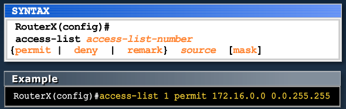

[Dynamic Routing - EIGRP](Cisco2-5.md) |	[Home](index.html)

MODULE 6 LESSON 1
=================

# Introducing ACL Operation
--------

## Why use ACLs?
*	Filtering: Manage IP traffic by filtering packets passing through a router
*	Classification: Identify traffic for special handling

### Simple ACL
*	Global Configuration Mode
	*	access-list 10 deny host 172.16.32.5
	*	access-list 10 permit 172.16.32.0 0.0.7.255
	*	int gi 1/0
	*	ip access-group 10 in

### ACL Applications: Filtering
*	Permit or deny packets moving through the router.
*	Permit or deny vty access to or from the router.
*	Without ACLs, all packets could be transmitted to all parts of your network.

### ACL Applications: Classification
*	Special handling for traffic based on packet tests

## Outbound ACL Operation
*	If no ACL statement matches, discard the packet.
*	
*	

### List of Tests: Deny or Permit
*	**ACL Rules of engagement**
	1.	Top down processing
	2.	Immediate Execution Upon a Match
	3.	**Implicit *Deny Any* At the End**
*	

## Types of ACLs
*	Standard ACL
	*	Checks source address (has no access to destination address)
	*	Permits or denies entire protocol suite
	*	*access-list 10 permit 192.168.30.0 0.0.0.255*
*	Extended ACL
	*	Checks source AND destination address
	*	Generally permits or denies specific protocols and application
		*	Source and destination TCP and UDP ports
		*	Protocol type (IP, ICMP, UDP or protocol number)
	*	*access-list 103 permit tcp 192.168.30.0 0.0.0.255 any eq 80*

### Identifying ACLs
*	2 methods used to identify standard and extended ACLs:
	*	Numbered ACLs use a number for identification
		*	(1-99) and (1300-1999): Standard IP ACL
		*	(100-199) and (2000 to 2699): Extended IP ACL
	*	Named ACLs use a descriptive name or number for identification
		*	Names can contain alphanumeric characters
		*	Can add or delete entries within the ACL

### IP Access List Entry Sequence Numbering
*	ACLs support sequence numbering
*	Allows you to edit the order of ACL statements using sequence numbers
*	Allows you to remove a single ACL statement from the list using a sequence number.

## ACL Configuration Guidelines
*	Standard or Extended indicates what is filtered
*	The order of ACL Statements controls testing; therefore, the most specific statements go at the top of the list automatically.
*	**The last ACL test is always an implicit "deny everything else" statement, so every list needs at least one "permit" statement.**
*	ACLs are created globally and then applied to 1 or more ints for inbound or outbound traffic.
*	An ACL can filter traffic going through the router, or traffic to and from the router, depending on how it is applied.
	*	Through: 
	*	To and From: 
*	Only one ACL per interface, per protocol, and per direction is allowed.
*	When placing ACLs in the network
	*	Place extended ACLs as close to the source as possible
		*	ie: Prevent certain TCP traffic from eating up bandwidth as early as possible
	*	Place standard ACLs as close to the destination as possible
		*	ie:	allow source to get as far as possible to only process the packet at the last possible moment (performance reasons)

### Dynamic ACLs (Lock and Key)
*	Users that want to traverse the router are blocked until they use Telnet to connect to the router and are authenticated.
*	**Not common**

### Reflexive ACLs
*	Used to allow outbound traffic and limit inbound traffic in response to sessions that originate inside the router
*	Responsive
*	**Depricated**

### Time-Based ACLs
*	Used to allow for access control based on time of day and week
*	*ie: do not allow http after midnight and before 5 am*

## Wildcard Bits: How to check the corresponding address bits
*	0 means to match the value of the corresponding address bit
*	1 means to ignore the value of the corresponding address bit
*	

### Converting Mask to Wildcard Mask
	Subtract subnet mask from a mask of 255.255.255.255. 
	This will reverse your mask and convert it to a wildcard mask
	
	 255.255.255.255
	-255.255.  0.  0 (/16)
	----------------
	   0.  0.255.255
	
	 255.255.255.255
	-255.255.240.  0 (/20)
	----------------
	   0.  0. 15.255

### Wildcard Bit Mask Abbreviations
*	172.30.16.29 0.0.0.0 matches all address bits
*	You can abbreviate this mask using:
	*	**host** 172.30.16.29

*	0.0.0.0 255.255.255.255 ignores all address bits
*	You can abbreviate this using **any**
	* 	ie: *access-list permit any*

MODULE 6 LESSON 2
=================

# Configuring and Troubleshooting ACLs
----------------------------------------

## Numbered Standard IPv4 ACL Configuration

*	The statement matches any source address that starts with 172.16.x.x
*	Standard ACL config uses 1 - 99, or 1300 - 1999, for the ACL number
*	The first entry is assigned a sequence number of 10, and successive entries are multiples of 10
*	The default wildcard mask is 0.0.0.0 (only standard ACL)

*	Display the current ACLs configured on RouterX
*	***no access-list 1* removes *THE ENTIRE* ACL 1.**
*	**Do not edit acl in global config mode**

## Applying Standard IPv4 ACLs to Interfaces
*	*RA(config-if)#ip access-group access-list-number {in|out}*
*	^^ Activates the list on an interface

*	**Example 1**
*	Permit my network only
*	Implicit deny all - not visible in the list
	*	Router(config)#access-list 1 permit 172.16.0.0 0.0.255.255
	*	Router(config)#int ethernet 0
	*	Router(config-if)#ip access-group 1 out
	*	Router(config)#int ethernet 1
	*	Router(config-if)#ip access-group 1 out
	*	

----------------------------------------------------
*	**Example 2**	
*	Deny a specific host
*	Implicit deny all - not visible in the list
	*	Router(config)#access-list 1 deny 172.16.4.13 0.0.0.0
	*	Router(config)#access-list 1 permit 0.0.0.0 255.255.255.255
	*	Router(config)#int ethernet 0
	*	Router(config-if)#ip access-group 1 out
	*	

---------------------------------------------------
*	**Example 3**	
*	Deny a specific subnet
*	Implicit deny all - not visible in the list
	*	Router(config)#access-list 1 deny 172.16.4.0 0.0.0.255
	*	Router(config)#access-list 1 permit any
	*	Router(config)#int ethernet 0
	*	Router(config-if)#ip access-group 1 out
	*		

## Standard ACLs to control vty access
*	Restrict incoming connections between a particular vty and the addresses in ACL 12
	*	RouterX(config-line)#access-class 12 in
*	Permit only hosts in 192.168.1.0 255.255.255.0 to connect to the router vty lines
	*	Router(config)#access-list 12 permit 192.168.1.0 0.0.0.255
	*	Router(config-if)#access-class 12 in

# Extended ACLs

