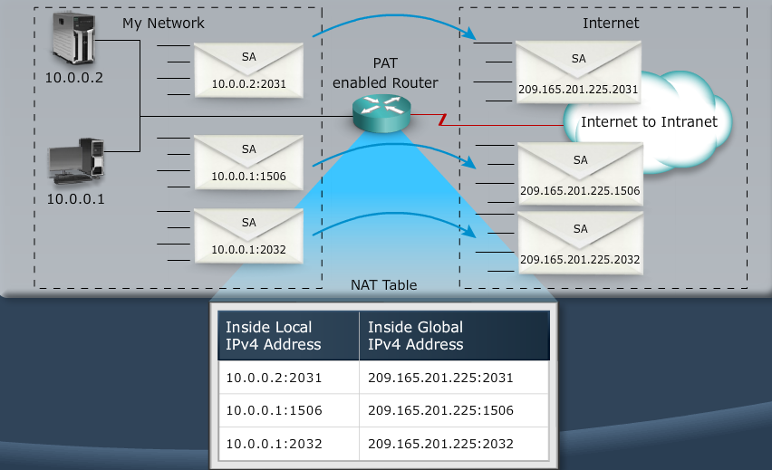

[ACLs](Cisco2-6.md)		|		[Home](index.html)		|		 

# NAT & PAT
------------

MODULE 7 LESSON 1
=================

# Scaling the Network with NAT & PAT

## NAT (Network Address Translation)
*	Allows private users to access the Internet by sharing one or more public IP addresses
*	An IP address is either local or global
*	Local IPv4 addresses are seen inside the network
*	Global IPv4 addresses are seen outside the network
*	Can work in many forms:
	*	Static NAT (one to one) - Servers
	*	Dynamic NAT (many to many) - pool of public addresses
	*	NAT overloading (aka Port Address Translation)(many to one)
*	NAT operation is transparent to users
*	Benefits include improved security and scalability
*	Drawbacks include performance degradation and incompatibility with certain applications that depend on end-to-end functionality.

## PAT

### Translating inside Source address

### Configuring and Verifying static nat
*	Establish static translation between an inside local address and an outside global address
	*	*(config)#ip nat inside source static 10.1.1.1 209.165.200.225*
*	Mark the interface as connected to the inside
	*	*(config-if)#ip nat inside*
*	Mark the interface as connected to the outside
	*	*(config-if)#ip nat outside*
*	Display active translations
	*	*show ip nat translations*

### Enabling Static NAT Map
*	*interface s0*
*	*ip address 209.165.200.2 255.255.255.240*
*	*ip nat outside*
*	*interface e0*
*	*ip address 10.1.1.1 255.255.255.0*
*	*ip nat inside*
*	*ip nat inside source static 10.1.1.2 209.165.200.225*
*	*show ip nat translations*
	*	*209.165.20.225	10.1.1.2*

## Dynamic Address Translation

*	**Syntax:** *Router(config)#ip nat pool name start-ip end-ip {netmask 255.255.255.255 | prefix-length length}*
	*	Define a pool NET209 of global addresses to be allocated as needed
		*	*(config)#ip nat pool NET209 209.165.200.225 209.165.200.238 netmask 255.255.255.240*
*	**Syntax:** *Router(config)#access-list access-list-number permit source [source-wildcard]*
	*	Define a standard IP ACL 1permitting inside local addresses that are to be translated
		*	*(config)#access-list 1 permit 192.168.1.0 0.0.0.255*
*	**Syntax:** *Router(config)#ip nat inside source list access-list-number pool name*
	*	Establish dynamic source translation, specifying the ACL that was defined in the previous step
		*	*(config)#ip nat inside source list 1 NET209*
	*	Display active translations
		*	*Router#show ip nat translations*

## Overloading an Inside Global Address (PAT or NAT Overloading)

### Configuring Overloading
*	Define a standard IP ACL 1 permitting inside local addresses that are to be translated
	*	*acces-list 1 permit 192.168.3.0 0.0.0.255*
*	Establish dynamic source translation, specifying the ACL that was defined in the previous step
	*	*ip nat inside source list 1 interface Serial0 overload*
	*	*ip nat inside source list 1 pool POOL overload* - to overload a range of addresses
	*	The overload keyword enables the addition of th port number to the translation
*	Display active translations
	*	*show ip nat translations*

----
	hostname RouterX
	interface e0
		ip address 192.168.3.1 255.255.255.0
		ip nat inside
	interface e1
		ip address 192.168.4.1 255.255.255.0
		ip nat inside
	interface s0
		description to ISP
		ip address 209.165.200.225 255.255.255.240
		ip nat outside
	ip nat inside source list 1 interface Serial0 overload
	ip route 0.0.0.0 0.0.0.0 Serial0
	access-list 1 permit 192.168.3.0 0.0.0.255
	access-list 1 permit 192.168.4.0 0.0.0.255

### Clearing NAT Table
*	clear ip nat translation *
*	clear ip nat translation inside 209.165.200.225 192.168.3.7
*	clear ip nat translation tcp inside 209.165.200.225 1050 192.168.3.7 1050

## Translation not occurring: Translation not installed in table
*	Verify that:
	*	No inbound ACLs are denying the packets entry to the NAT router
	*	The ACL referenced by the NAT command is permitting all necessary networks
	*	There are enough addresses in the NAT pool
	*	The route interfaces are appropriately defined as NAT inside or NAT outside

### NAT Information
*	show ip nat statistics
	*	
*	debug ip nat - will crash router in production environment
	*	
	
### Translation occurring: Installed translation entry not being used
*	Verify that:
	*	What the nat config is supposed to accomplish
	*	That the nat entry exists in the translation table and that it is accurate
	*	That the translation is actually taking place by monitoring the nAT process or statistics
	*	That the NAT router has the appropriate route in the routing table if the packet is going from inside to outside
	*	That all necessary routers have a return route back to the translated address

