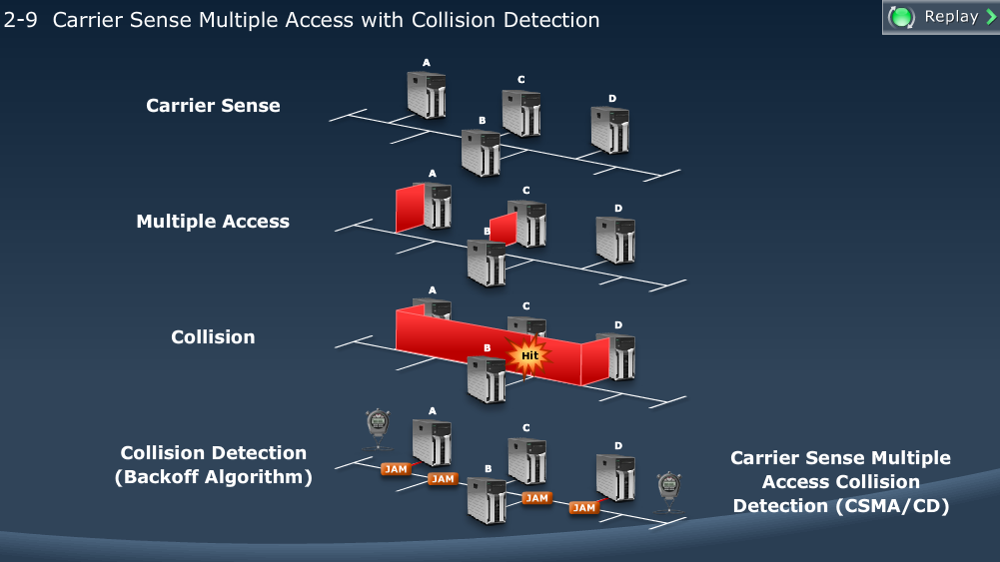
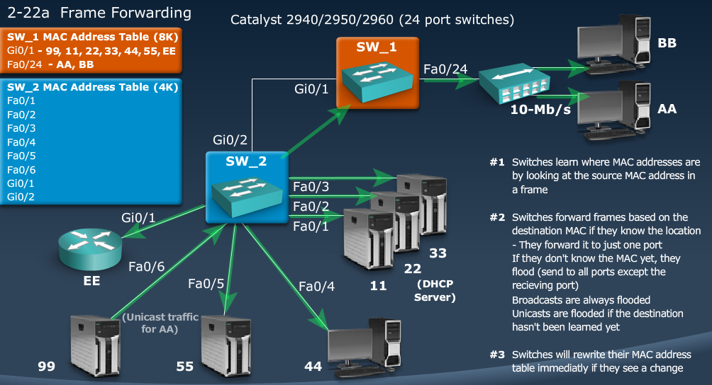
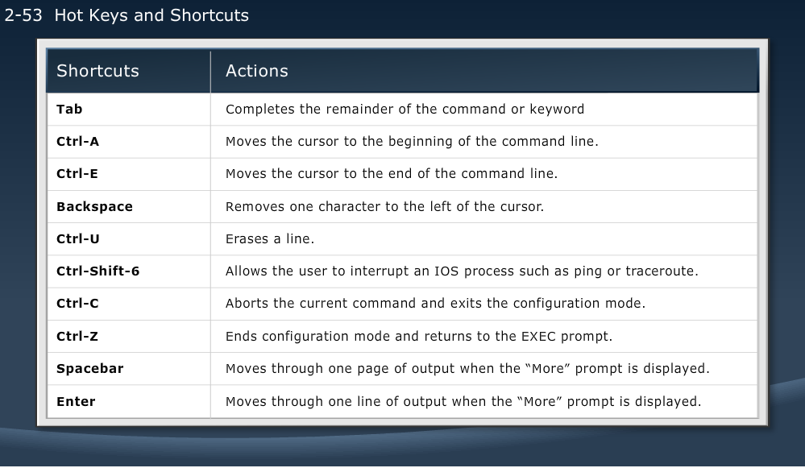

[Networking Fundamentals and Concepts](Cisco1.md) | [List](index.html) | [Module 3](Cisco3.md)

MODULE 2 LESSON 1
=================

# Shared (Switched) LAN

## LAN Segment Limitations

*	LAN Segment: a part of network where every device communicates using the same physical medium
*	Signals degrade with transmission distance
*	Each Ethernet type has a max segment length
*	LANS can be extended by adding a layer 1 device (hub or repeater) or layer 2 device (switch or bridge)
*	Extending segments can cause
	*	sharing bandwidth
	*	extending cable distances
	*	repeating or amplifying signals

### Collisions

*	Each port on a hub is a member of a single collision domain
	*	Every device hears every other device that is connected to any port on the hub
*	On a switch, each port has it's own collision domain
	*	Devices can only hear broadcast traffic from other devices on the *same port*

### Carrier Sense Multiple Access with Collision Detection

MODULE 2 LESSON 2
=================

# Solving challenges with Switched LAN Technology

### Bridges
	
*	Divide an Ethernet LAN into multiple segments for more collision domains
*	Layer 2 Device
*	Forward, Filter, or flood frames
*	Have few ports
*	SLOW

### Switches

*	Also Layer 2
*	Forward, filter, or flood frames based on MAC address tables
*	Have many full-duplex ports to segment a large LAN into many smaller segments
*	Fast, support different port speeds

### LAN Switches

*	High port density
*	Large frame buffers
*	Mixture of port speed
*	Fast internal switching
*	Low per-port cost
*	Switching modes:
	*	Store-and-Forward - Variable latency
	*	Cut-through
		*	Fragment-free - Waits 64 bytes - potentially corrupts data
		*	Cut-through (fast-forward) - Sends as soon as the destination MAC address field is read - potentially corrupts data

**Features**
*	Dedicated Communication between devices
*	Multiple simultaneous conversatinos
*	Full-Duplex communication - only if there are no hubs
*	Media-Rate adaption

## Switching Frames

1. 	The switch receives a broadcast from PC A on Port 1
2. 	The switch enters the MAC address and the switch port that received the frame into the MAC table
3. 	Because destination address is broadcast, the switch floods the frame to all ports, except the source port
4.	The destination device replies to the broadcast with a unicast frame destined to PC A
5.	The switch enters the source MAC address of PC B and the address of the port that received the frame in the the MAC table; the destination address of the frame and and its associated port is found in the MAC table
6.	The switch can now forward frames between source and destination devices without flooding, b/c it has entries in the MAC table that identify the associated ports

### Frame Forwarding

1.	Switches learn where MAC addresses are by looking at the source MAC Address in a frame
2.	Switches forward frames based on the destination MAC address 
	*	if they know the location, they forward it to 1 port
	*	if they don't know the MAC yet, they flood
	*	broadcasts are always flooded
	*	unicasts are flooded if the destination has not yet been learned
3.	Switches will rewrite their MAC Address table immediately if they detect a change
	
	
	

### LANs today
	
*	Users grouped by physical location
*	More switches added to networks
*	Support advanced features:
	*	Port security
	*	VLANs
	*	Port speeds
	*	PoE
	*	Link aggregation
	
	

MODULE 2 LESSON 3
=================

# Packet Delivery

### Layer 2 Addressing (revisited)

*	Ethernet uses MAC Addresses
*	IDs end devices in LAN
*	Enables packet to be carried by media across each segment

###	Layer 3 Addressing 

*	Each protocol stack has its own network address format
	*	OSI uses NSAP
	*	TCP/IP uses IP
*	Enables ID of hosts in different networks
*	Enables packet to be forwarded to its destination

## Summary

*	A host-to-host data communication in a LAN that is using a switch utilizes protocols from every layer of the TCP/IP protocol suite
	*	If the MAC Address is unknown, ARP is used to map Layer 2 to Layer 3 (MAC to IP)
	*	Switches learn the MAC Addressing to port mapping by monitoring the source MAC addresses of frames
	*	When a switch forwards a frame, it does not change the source or destination Layer 2 addresses

MODULE 2 LESSON 4
=================

# Operating Cisco IOS Software

**IOS = Internetwork Operating System**

## Configuring Network Devices

*	Initial default settings are sufficient for switch to operate as Layer 2 switch
*	A Cisco device will prompt for initial config if there is no config in memory
*	Additional config tasks set up the device with:
	*	Protocol addressing and parameter settings
	*	Options for administration and management
	
### Cisco Device Startup

1.	Find and check device hardware
2. 	Find and load Cisco IOS Software image
3.	Find and apply device configurations

### Configuration sources

*	Console - rollover cable
*	AUX Port - disabled by default
	*	Can be used to connect a modem for "dial in" management connectivity
*	Telnet/SSH
*	TFTP
*	Web Interface or Network Management Server(SNMP)

## Cisco Interface Functions

*	CLI is used to enter commands
*	Operations vary on different devices
*	Users type or paste entries in console command modes
*	Command modes have distinct prompts - >, #
*	The Enter key instructs the device to parse and execute the command
*	2 primary EXEC modes are user mode and privileged mode

### EXEC Modes

1.	User Mode
	*	First prompt when log in
	*	privilege level of 1
	*	very limited examination of switch or router
	*	command prompt = hostname>
	
2.	Privileged (Enabled) Mode
	*	privilege level of 15
	*	enables configuration and debugging
	*	Detailed examination
	*	command prompt = hostname#
	
**Banners**

*	LINE            c banner-text c, where 'c' is a delimiting character
*	exec            Set EXEC process creation banner
*	incoming        Set incoming terminal line banner
*	login           Set login banner
*	motd            Set Message of the Day banner
*	prompt-timeout  Set Message for login authentication timeout
*	slip-ppp        Set Message for SLIP/PPP

MODULE 2 LESSON 5
=================

# Startup of Catalyst Switch

## LED Indicators

*	System LED
	* Failed POST - Amber Light
*	Redundant Power Supply LED
*	Port Status LEDs
*	Port Mode LEDs
*	Mode Button

### Initial Bootup

Gives you the MAC Address, then loads binary startup config from flash memory

	erase startup-config #erases all configuration

Answer no to initial configuration dialog and you get to a Switch> User-Mode Prompt

**Global Config Mode** - configure terminal

	Switch(config)#

**Interface Config Mode** - interface gi0/1

	Switch(config-if)#

	Switch>enable
	Switch#conf t
	Switch(config)#int fa 0/1
	Switch(config-if)#description Link to other end
	Switch(config-if)#do show interface status | include Fa0/1
	Fa0/1	Link to other end	notconnect	1	auto	auto	10/100BaseTX
	Switch(config-if)#exit
	Switch(config)#interface range fa 0/1-8
	Switch(config-if-range)#speed auto
	Switch(config-if-range)#exit
	Switch(config)#interface range fa 0/1-8 , fa0/10-12
	Switch(config-if-range)#

### To enable IP Connectivity

1.	Set hostname (make it descriptive - location, number, etc)
2.	Set IP Address
	*	Switch#conf t
	*	Switch(config)#interface vlan 1
	*	Switch(config-if)#ip address {ip address} {mask}
	*	Switch(config-if)#no shutdown
3.	Configure gateway
	*	Switch(config)#ip default-gateway {router address}
4.	Enable remote access (Telnet, ssh)
	*	Switch(config)#line vty 0 4 #vty 0 4 is telnet
	*	Switch(config-line)#password {password}
5.	**Copy current configuration to NVRAM**
	*	copy running-config startup-config (copy run start)

### Some Basic show commands

	show version - OS, system hardware, config and boot files
	show running-config - shows current active configuration
	show interfaces - shows statistics for all interfaces
	show interface brief, show interface status

*	show interface fa0/2 - gives layer 1 and layer 2 info
	*	important info:
	
		FastEthernet0/2 is up, line protocol is up (connected)
			Hardware is Fast Ethernet, address is {mac address}
			Full-duplex, 100Mb/s
			0 CRC
			0 collisions
			
### MAC Address Table

*	show mac-address-table dynamic - shows only the dynamic(learned) mac addresses
*	clear mac-address-table - will not use often

