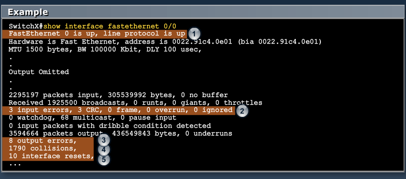

[Networking Fundamentals and Concepts](Cisco1.md)  |  [List](index.html)  |  [Wireless LANs](Cisco3.md)

# Cisco LAN Switching
-----------------------

MODULE 2 LESSON 1
=================

# Shared (Switched) LAN

## LAN Segment Limitations

*	LAN Segment: a part of network where every device communicates using the same physical medium
*	Signals degrade with transmission distance
*	Each Ethernet type has a max segment length
*	LANS can be extended by adding a layer 1 device (hub or repeater) or layer 2 device (switch or bridge)
*	Extending segments can cause
	*	sharing bandwidth
	*	extending cable distances
	*	repeating or amplifying signals

### Collisions

*	Each port on a hub is a member of a single collision domain
	*	Every device hears every other device that is connected to any port on the hub
*	On a switch, each port has it's own collision domain
	*	Devices can only hear broadcast traffic from other devices on the *same port*

### Carrier Sense Multiple Access with Collision Detection

MODULE 2 LESSON 2
=================

# Solving challenges with Switched LAN Technology

### Bridges
	
*	Divide an Ethernet LAN into multiple segments for more collision domains
*	Layer 2 Device
*	Forward, Filter, or flood frames
*	Have few ports
*	SLOW

### Switches

*	Also Layer 2
*	Forward, filter, or flood frames based on MAC address tables
*	Have many full-duplex ports to segment a large LAN into many smaller segments
*	Fast, support different port speeds

### LAN Switches

*	High port density
*	Large frame buffers
*	Mixture of port speed
*	Fast internal switching
*	Low per-port cost
*	Switching modes:
	*	Store-and-Forward - Variable latency
	*	Cut-through
		*	Fragment-free - Waits 64 bytes - potentially corrupts data
		*	Cut-through (fast-forward) - Sends as soon as the destination MAC address field is read - potentially corrupts data

**Features**
*	Dedicated Communication between devices
*	Multiple simultaneous conversatinos
*	Full-Duplex communication - only if there are no hubs
*	Media-Rate adaption

## Switching Frames

1. 	The switch receives a broadcast from PC A on Port 1
2. 	The switch enters the MAC address and the switch port that received the frame into the MAC table
3. 	Because destination address is broadcast, the switch floods the frame to all ports, except the source port
4.	The destination device replies to the broadcast with a unicast frame destined to PC A
5.	The switch enters the source MAC address of PC B and the address of the port that received the frame in the the MAC table; the destination address of the frame and and its associated port is found in the MAC table
6.	The switch can now forward frames between source and destination devices without flooding, b/c it has entries in the MAC table that identify the associated ports

### Frame Forwarding

1.	Switches learn where MAC addresses are by looking at the source MAC Address in a frame
2.	Switches forward frames based on the destination MAC address 
	*	if they know the location, they forward it to 1 port
	*	if they don't know the MAC yet, they flood
	*	broadcasts are always flooded
	*	unicasts are flooded if the destination has not yet been learned
3.	Switches will rewrite their MAC Address table immediately if they detect a change
	
	
	

### LANs today
	
*	Users grouped by physical location
*	More switches added to networks
*	Support advanced features:
	*	Port security
	*	VLANs
	*	Port speeds
	*	PoE
	*	Link aggregation
	
	

MODULE 2 LESSON 3
=================

# Packet Delivery

### Layer 2 Addressing (revisited)

*	Ethernet uses MAC Addresses
*	IDs end devices in LAN
*	Enables packet to be carried by media across each segment

###	Layer 3 Addressing 

*	Each protocol stack has its own network address format
	*	OSI uses NSAP
	*	TCP/IP uses IP
*	Enables ID of hosts in different networks
*	Enables packet to be forwarded to its destination

## Summary

*	A host-to-host data communication in a LAN that is using a switch utilizes protocols from every layer of the TCP/IP protocol suite
	*	If the MAC Address is unknown, ARP is used to map Layer 2 to Layer 3 (MAC to IP)
	*	Switches learn the MAC Addressing to port mapping by monitoring the source MAC addresses of frames
	*	When a switch forwards a frame, it does not change the source or destination Layer 2 addresses

MODULE 2 LESSON 4
=================

# Operating Cisco IOS Software

**IOS = Internetwork Operating System**

## Configuring Network Devices

*	Initial default settings are sufficient for switch to operate as Layer 2 switch
*	A Cisco device will prompt for initial config if there is no config in memory
*	Additional config tasks set up the device with:
	*	Protocol addressing and parameter settings
	*	Options for administration and management
	
### Cisco Device Startup

1.	Find and check device hardware
2. 	Find and load Cisco IOS Software image
3.	Find and apply device configurations

### Configuration sources

*	Console - rollover cable
*	AUX Port - disabled by default
	*	Can be used to connect a modem for "dial in" management connectivity
*	Telnet/SSH
*	TFTP
*	Web Interface or Network Management Server(SNMP)

## Cisco Interface Functions

*	CLI is used to enter commands
*	Operations vary on different devices
*	Users type or paste entries in console command modes
*	Command modes have distinct prompts - >, #
*	The Enter key instructs the device to parse and execute the command
*	2 primary EXEC modes are user mode and privileged mode

### EXEC Modes

1.	User Mode
	*	First prompt when log in
	*	privilege level of 1
	*	very limited examination of switch or router
	*	command prompt = hostname>
	
2.	Privileged (Enabled) Mode
	*	privilege level of 15
	*	enables configuration and debugging
	*	Detailed examination
	*	command prompt = hostname#
	
**Banners**

*	LINE            c banner-text c, where 'c' is a delimiting character
*	exec            Set EXEC process creation banner
*	incoming        Set incoming terminal line banner
*	login           Set login banner
*	motd            Set Message of the Day banner
*	prompt-timeout  Set Message for login authentication timeout
*	slip-ppp        Set Message for SLIP/PPP

MODULE 2 LESSON 5
=================

# Startup of Catalyst Switch

## LED Indicators

*	System LED
	* Failed POST - Amber Light
*	Redundant Power Supply LED
*	Port Status LEDs
*	Port Mode LEDs
*	Mode Button

### Initial Bootup

Gives you the MAC Address, then loads binary startup config from flash memory

	erase startup-config #erases all configuration

Answer no to initial configuration dialog and you get to a Switch> User-Mode Prompt

**Global Config Mode** - configure terminal

	Switch(config)#

**Interface Config Mode** - interface gi0/1

	Switch(config-if)#

	Switch>enable
	Switch#conf t
	Switch(config)#int fa 0/1
	Switch(config-if)#description Link to other end
	Switch(config-if)#do show interface status | include Fa0/1
	Fa0/1	Link to other end	notconnect	1	auto	auto	10/100BaseTX
	Switch(config-if)#exit
	Switch(config)#interface range fa 0/1-8
	Switch(config-if-range)#speed auto
	Switch(config-if-range)#exit
	Switch(config)#interface range fa 0/1-8 , fa0/10-12
	Switch(config-if-range)#

### To enable IP Connectivity

1.	Set hostname (make it descriptive - location, number, etc)
2.	Set IP Address
	*	Switch#conf t
	*	Switch(config)#interface vlan 1
	*	Switch(config-if)#ip address {ip address} {mask}
	*	Switch(config-if)#no shutdown
3.	Configure gateway
	*	Switch(config)#ip default-gateway {router address}
4.	Enable remote access (Telnet, ssh)
	*	Switch(config)#line vty 0 4 #vty 0 4 is telnet
	*	Switch(config-line)#password {password}
5.	**Copy current configuration to NVRAM**
	*	copy running-config startup-config (copy run start)

### Some Basic show commands

	show version - OS, system hardware, config and boot files
	show running-config - shows current active configuration
	show interfaces - shows statistics for all interfaces
	show interface brief, show interface status

*	show interface fa0/2 - gives layer 1 and layer 2 info
	*	important info:
	
		FastEthernet0/2 is up, line protocol is up (connected)
			Hardware is Fast Ethernet, address is {mac address}
			Full-duplex, 100Mb/s
			0 CRC
			0 collisions
			
### MAC Address Table

*	show mac-address-table dynamic - shows only the dynamic(learned) mac addresses
*	clear mac-address-table - will not use often

MODULE 2 LESSON 6
=================

# Understanding Switch Security

### Threats to Physical Installations

*	Hardware threats
*	Environmnental threats
*	Electrical threats
*	Maintenance threats 

## Setting switch passwords

*	line vty 0 4 - 5 virtual teletype lines enabled by default
*	enable secret - uses md5 hash
*	enable password - no encryption
*	service password-encryption - sets level 7 encryption on current and future passwords (weak encryption)

### SSH

	Switch#conf t
	Switch(config)#username <username> password/secret <password>
	Switch(config)#ip domain-name <domain name>
	Switch(config)#crypto key generate rsa
		How many bits in the modulus [512] <desired bits>
	Switch(config)#ip ssh version 2
	Switch(config)#line vty 5 15
	Switch(config-line)#login local
	Switch(config-line)#transport input ssh

## Configuring port security

	Switch(config)#interface <interface>
	Switch(config-if)#switchport mode access
	Switch(config-if)#switchport port-security
	Switch(config-if)#switchport port-security maximum 1
	Switch(config-if)#switchport port-security mac-address sticky
	Switch(config-if)#switchport port-security violation shutdown
*Configuration of <interface> to limit and identify MAC addresses of the stations that are allowed to access the port to 1.*
	
**Use *do* command to execute user EXEC or privileged EXEC commands from any configuration mode or submode**

	Switch(config-f)#show port-security interface fa 0/5
	                      ^
	% Invalid input detected at '^' marker.
	Switch(config-if)#do show port-security interface fa 0/5

**Other show port-security commands**
	
	show port-security address
	show port-security	

## Securing Unused Ports

*	Unsecured ports can create a security hole
*	A device that is plugged into an unused port will be added to the network.
*	Secure unused ports by disabling interfaces

## Interface range

*	to disable interface, use shutdown command in interface configuration mode
*	to shutdown multiple ports, use interface range command
	*	Switch(config)#interface range fa 0/1 - 3, fa 0/6 - 8
*	to restart them use no shutdown

MODULE 2 LESSON 7
=================

# Maximizing the benefits of switching

### Microsegmentation

*	Multiple traffic paths within switch
*	Happens when you have a point to point connection to a switch
*	NO HUBS

## Duplex overview

*	Half Duplex
	*	Unidirectional data flow
	*	Higher potential for collision
	*	Hub connectivity
*	Full Duplex
	*	Point-to-point only
	*	Attached to dedicated switched port
	*	Requires full-duplex support on both ends
	*	Collision-free
	*	Collision detect circuit disabled
	
### Setting duplex and speed

*	Must be in interface config mode
*	speed 10 || 100 || 1000 || auto
*	duplex auto || half || full
*	**Both sides must have same speed and duplex configurations**

## The Hierarchy of Connectivity

1. Core layer
	*	Provides optimal transport between core routers and distribution sites
2.	Distribution layer
	*	Provides policy-based connectivity, peer reduction, and aggregation
3.	Access layer
	*	Provides common group access to the internetworking environment
	
## Loops
*Loops may occur in the network as a part of a design strategy for redundancy.*

### Spanning Tree Protocol

*	1 switch is elected the root based on lowest bridge ID (priority and MAC address concatenated)
*	A tree-like, loop-free topology is established
*	One port logically blocks and does not send or receive traffic
	*	Ports can be marked F or B
	*	F - included in mac-address table
	*	B - excluded from mac-address table
	

MODULE 2 LESSON 8
=================

# Troubleshooting Interfaces

## Port access issues
	
*	Media-related
*	Duplex-related
*	Speed-related

### Duplex-related issues

*	One end set to full and other half results in duplex mismatch
*	One end set to full and other set to auto
	*	Autonegotiation fails and reverts that end to half
	*	Results in mismatch
*	One end set to half and other set to auto
	*	Autonegotiation fails and reverts that end to half
	*	Both ends at half duplex - no mismatch 
	*	half to half operates at 40% efficiency

### Duplex modes

*	Auto on both ends
	*	one end fails to full, one to half
	*	Example: Gigabit on one end (not capable of half) and FA on other end
	
*	Auto on both ends
	*	If autonegotiation fails, both revert to half
	*	no mismatch - better than mismatch
	
## Speed-related issues

*	Speed mismatch results in no connectivity
*	One end 100 other 10 - mismatch
*	Auto at one end and high speed at other
	*	If autonegotiation fails, the auto end reverts to lowest supported speed
	*	results in mismatch
*	Auto on both ends
	*	If autonegotiatoin fails, both revert to their lowest speed
	*	usually no mismatch on auto
	
## Media-related issues

*	Damaged wiring
*	Electromagnetic Interference EMI
*	Changed traffic patterns
*	Excede bandwitch of media
*	New equipment installed, not configured properly

### show interface

1.	Make sure ethernet is up and line protocol is up (up/up)
2.	CRC errors - make sure there are no late collisions, could be EMI

    EMI
 	Caused when copper runs across items with a lot of electormagnetic output
	Flourescent lights, modems, etc
	
### Excessive collisions

*	show interface determines rate of collisions
*	TDR(Time Domain Reflectometer) finds ethernet cables not terminated
*	Look for jabbering transceiver attached to a host.
	*	May require host by host inspection or the use of a protocol analyzer
	
### Late collisions

*	5-4-3 rule
	*	5 segments
	*	4 repeaters
	*	3 segments can have end users
*	Use protocol analyzer to check for late collisions. 
	*	Should never occur in a properly designed network
	*	usually occur when ethernet cables are too long or when too many repeaters
*	CRC Errors will occur
*	Duplex-mismatch likely cause

## Configuration Recommended Practices
1.	Know what you have before you start.
	*	Hard copy
	*	Text file
	*	TFTP server
2.	Verify changes before you save
	*	Confirm that issue was corrected and no new issues were created
3.	**Save current config**
	*	copy run start
4.	Secure the configuration
	*	password on console
	*	password on vty
	*	password on EXEC mode

