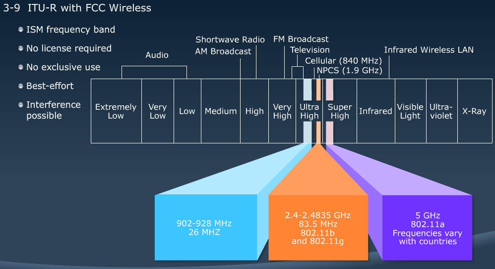
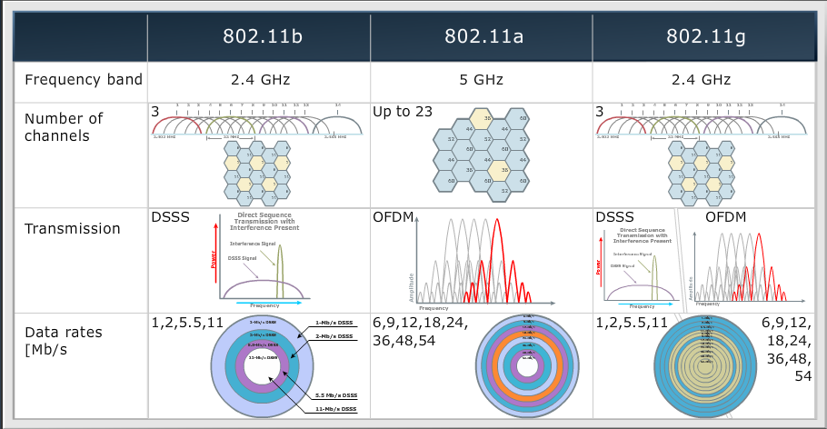
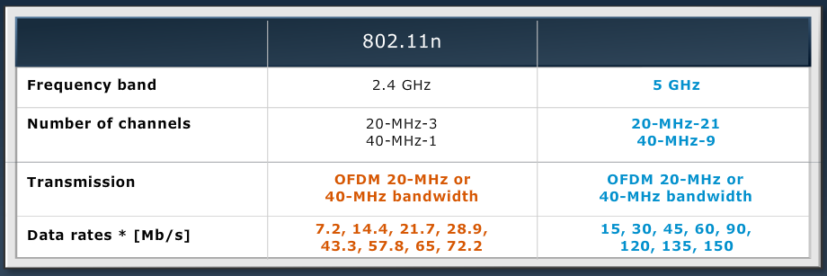
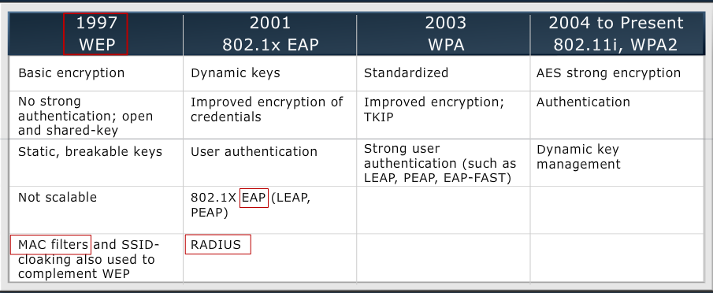
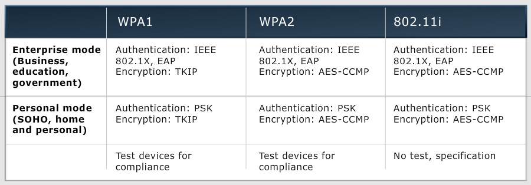

[Cisco LAN Switching](Cisco2.md) | [List](index.html)

# Wireless LANs
---------------

MODULE 3 LESSON 1
=================

# Exploring Wireless Networking

### Differences in WLAN and LAN

*	WLANs use radio waves as the physical layer
	*	Use CSMA/CA instead of CSMA/CD for media access
	*	2-way radio (half-duplex) communication
*	Radio waves have problems not found on wires
	*	Connectivity issues:
		*	Coverage problems
		*	Interference, noise
	*	Privacy issues
*	Access points are shared devices similar to an Ethernet hub for shared bandwidth.
*	WLANs must meet country-specific RF regulations.

### RF Transmission

*	Radio frequencies are radiated into the air via antenna, creating radio waves
*	Ofjects can affect radio wave propagation resulting in
	*	Reflection
	*	Scattering
	*	Absorption
*	Higher frequencies allow higher data rates, however have a shorter range

## WLAN Organizations

1.	ITU-R:
	*	regulates the RF used in wireless
2.	IEEE:
	*	802.11 documents wireless technical standards
3.	Wi-Fi Alliance
	*	Global nonprofit industry trade association
	*	Promotes wireless growth through interoperability certification
	*	Promote & certify standards such as WPA and WPA2

### ITU-R with FCC Wireless

**Standards Comparison**

*	802.11b
	*	2.4GHz
	*	3 channels 1, 6, 11
	*	DSSS(Direct Sequence Spread Spectrum) Transmission with Interference Present
	*	Data rates - 1, 2, 5.5, 11
		*	Set data rate based on RSSI(received signal strength indicator) and SNR(signal noise ratio)
*	802.11g
	*	2.4GHz
	*	Backward compatible with b
	*	Supports DSSS and OFDM(Orthogonal frequency-division multiplexing) Transmission
	*	Data rates - b ranges and 6, 9, 12, 18, 24, 36, 48, 54
*	802.11a
	*	5GHz
	*	Up to 23 channels
	*	OFDM Transmission
	*	Data rates - 6, 9, 12, 18, 24, 36, 48, 54
*	802.11n
	*	Can use 2.4GHz *OR* 5GHz
	*	OFDM Transmission
	*	
	
### Wi-Fi Certification

**Wi-Fi Alliance certifies interoperability between products.**
	*	Products include 802.11a, 802.11b, 802.11g, 802.11n, dual-band products, and security testing
	*	Provides assurance to customers regarding migration and integraion

**Cisco is a founding member of the Wi-Fi Alliance**
[Certified Products](http://www.wi-fi.org)

MODULE 3 LESSON 2
=================

# Understanding WLAN Security

## Security Threats
1.	War Driver - find open networks for free internet access
2.	Hackers - Exploit weak privacy measure to view sensitive WLAN info and break into WLANs
3.	Employees - Plug consumer-grade APs into company ethernet ports to create their own WLANs

### Mitigating Threats
1.	Authentication
	*	ensure that legitimate clients assocaite with trusted APs
	*	RADIUS
2.	Encryption
	*	protect data as it is transmitted and received
	*	WEP, WPA, WPA2
3.	Intrusion Prevention System
	*	track and mitigate unauthorized access and network attacks.
	
## Evolution of Wireless Security

	TKIP	- 	Temporal Key Integrity Protocol
	AES		- 	Advanced Encryption Standard
	CCMP	- 	Counter Mode with CBC–MAC
	EAP 	- 	Extensible Authentication Protocol
	LEAP	- 	Lightweight Extensible Authentication Protocol
	PEAP	- 	Protected Extensible Authentication Protocol

## Wireless Client Association
1.	APs send out beacons announcing SSID, data rates, and other info
2.	Client scans all channels
3.	Client listens for beacons and responses from APs
4.	Client associates to AP with strongest signal
5.	Client repeats scan if signal becomes low to reassociate to another AP (roaming)
6.	During association, SSID, MAC address, and security settings are sent from the client to the AP, and checked by the AP

**802.1x is an authenticator**
1.	Client checks w/ AP
2.	AP checks with RADIUS server
3.	AP lets client know that their credentials work
4.	Client gains access

### WPA Modes
--------------

### Encryption types
1.	WEP
	*	Basic encryption
	*	Weak, easy to crack
2.	TKIP
	*	Solution to avoid WEP
	*	Part of WPA
3.	AES
	*	Stronger and most resource-consuming
	*	Part of WPA2 and 802.11i
4.	VPN
	*	Encrypted connection between private networks over a public network
	*	DES, 3DES, AES, SSL
	
	