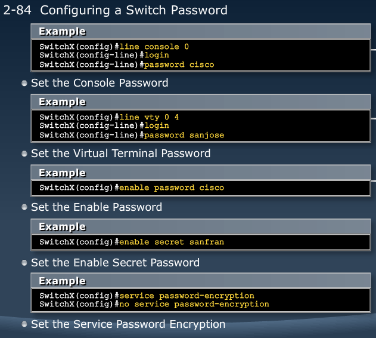

[Cisco LAN Switching](Cisco2.md) | [List](index.html)

MODULE 2 LESSON 6
=================

# Understanding Switch Security

### Threats to Physical Installations

*	Hardware threats
*	Environmnental threats
*	Electrical threats
*	Maintenance threats 

## Setting switch passwords

*	line vty 0 4 - 5 virtual teletype lines enabled by default
*	enable secret - uses md5 hash
*	enable password - no encryption
*	service password-encryption - sets level 7 encryption on current and future passwords (weak encryption)

### SSH

	Switch#conf t
	Switch(config)#username <username> password/secret <password>
	Switch(config)#ip domain-name <domain name>
	Switch(config)#crypto key generate rsa
		How many bits in the modulus [512] <desired bits>
	Switch(config)#ip ssh version 2
	Switch(config)#line vty 5 15
	Switch(config-line)#login local
	Switch(config-line)#transport input ssh

## Configuring port security

	Switch(config)#interface <interface>
	Switch(config-if)#switchport mode access
	Switch(config-if)#switchport port-security
	Switch(config-if)#switchport port-security maximum 1
	Switch(config-if)#switchport port-security mac-address sticky
	Switch(config-if)#switchport port-security violation shutdown
*Configuration of <interface> to limit and identify MAC addresses of the stations that are allowed to access the port to 1.*
	
**Use *do* command to execute user EXEC or privileged EXEC commands from any configuration mode or submode**

	Switch(config-f)#show port-security interface fa 0/5
	                      ^
	% Invalid input detected at '^' marker.
	Switch(config-if)#do show port-security interface fa 0/5

**Other show port-security commands**
	
	show port-security address
	show port-security	

## Securing Unused Ports

*	Unsecured ports can create a security hole
*	A device that is plugged into an unused port will be added to the network.
*	Secure unused ports by disabling interfaces

## Interface range

*	to disable interface, use shutdown command in interface configuration mode
*	to shutdown multiple ports, use interface range command
	*	Switch(config)#interface range fa 0/1 - 3, fa 0/6 - 8
*	to restart them use no shutdown

MODULE 2 LESSON 7
=================

# Maximizing the benefits of switching

### Microsegmentation

*	Multiple traffic paths within switch
*	Happens when you have a point to point connection to a switch
*	NO HUBS

## Duplex overview

*	Half Duplex
	*	Unidirectional data flow
	*	Higher potential for collision
	*	Hub connectivity
*	Full Duplex
	*	Point-to-point only
	*	Attached to dedicated switched port
	*	Requires full-duplex support on both ends
	*	Collision-free
	*	Collision detect circuit disabled
	
### Setting duplex and speed

*	Must be in interface config mode
*	speed 10 || 100 || 1000 || auto
*	duplex auto || half || full
*	**Both sides must have same speed and duplex configurations**

## The Hierarchy of Connectivity

1. Core layer
	*	Provides optimal transport between core routers and distribution sites
2.	Distribution layer
	*	Provides policy-based connectivity, peer reduction, and aggregation
3.	Access layer
	*	Provides common group access to the internetworking environment
