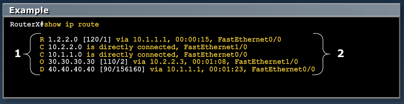
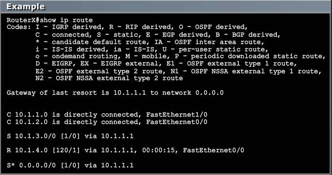
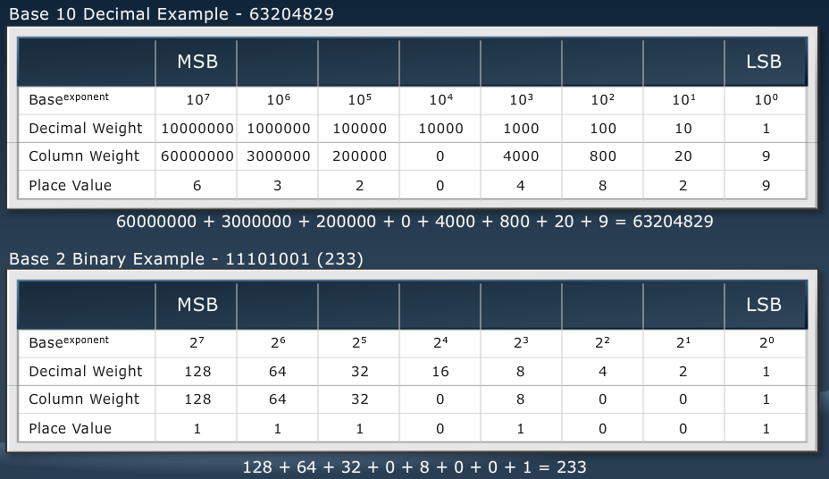
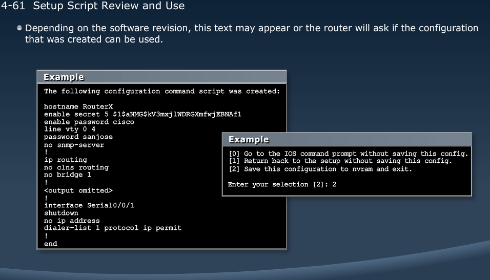
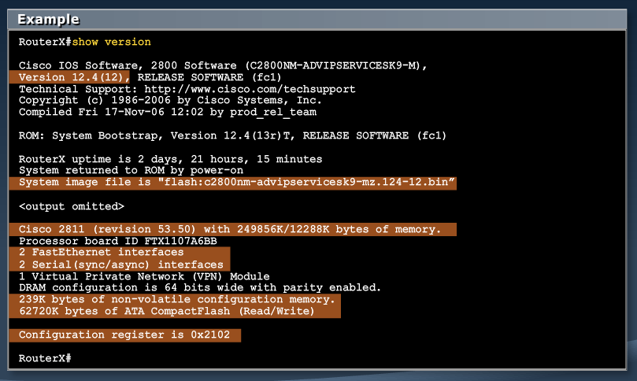
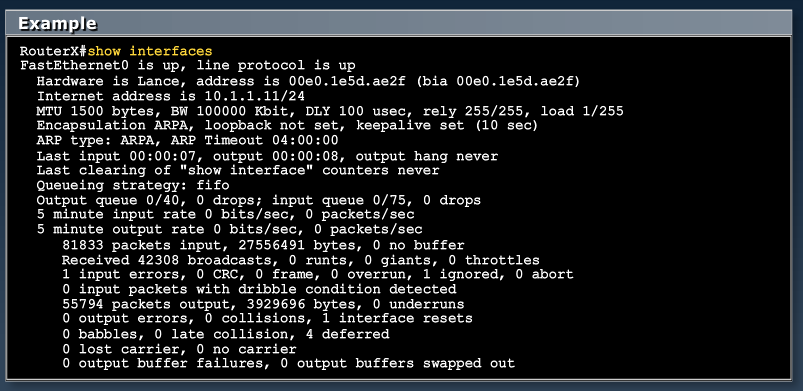
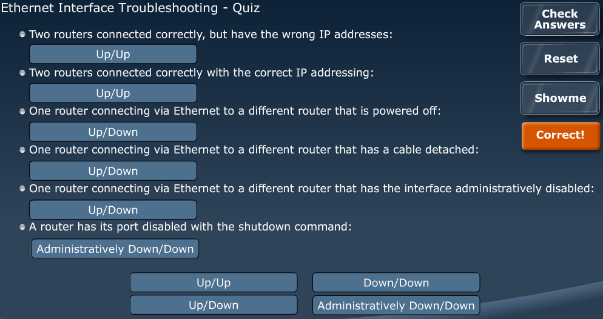

[Wireless LANs](Cisco3.md)  |  [List](index.html)  |  [Router & WAN Config](Cisco5.md)

# Router Fundamentals
---------------------

MODULE 4 LESSON 1
=================

## Routers

*	Routers have the following components
	*	CPU
	*	Motherboard
	*	Memory
*	Routers have network adapters to which IP addresses are assigned
*	Routers may have 2 kinds of ports
	*	Console/AUX
	*	Network
*	Routers forward packets based on a routing table

### Router Functions
1.	Gathers routing information and inform other routers about changes
2.	Determines where to forward packets
	
	
**Path determination**
Routers determine the best path to destination

## Routing Tables

**Routing tables list all known destinations and information regarding how to teach them.**
*All routers ahve to know ALL networks*

### Routing entries

**Directly connected** - Router attaches to this network
**Static routing** - Entered manually by an administrator
**Dynamic routing** - Learned by exchange of routing information - RIP, OSPF, EGP, BGP, EIGRP
**Default route** - Statically or Dynamically learned; used when no explicit route to network is known

### Dynamic Routing Protocols

*	Routing Information Protocol (RIP) - Standards based, distance vector routing protocol not well suited for medium to large networks
*	Open Shortest Path First (OSPF) - Standards based link-state routing protocol designed for large networks
*	Enhanced Interior Gateway Routing Protocol (EIGRP) - Cisco Proprietary hybrid routing protocol designed for large networks and offers fast convergence

**Routing Metrics**
*	RIP uses hop count
*	OSPF uses cost
*	EIGRP uses Bandwidth and Delay

### Distance Vector Routing Protocols
	Distance: How far?
	Vector: In which direction?
*	RIPv1, RIPv2, IGRP(Interior Gateway Routing Protocol)
*	Collect distance and vector to neighboring routers
*	Send periodic updates of routing table to neighbors

### Link-state Routing Protocols
*	OSPF, ISIS(Intermediate Systems to Intermediate Systems)
*	Create the network topology map
*	Send event-triggered link-state updates

MODULE 4 LESSON 2
=================

# Binary
---------

## Decimal vs. Binary

*	Decimals are written 0-9
*	Binary are written as 1s and 0s

| Decimal       | Binary        |
| ------------- |:-------------:|
| 0		        | 0			    |
| 1				| 1				|
| 2				| 10			|
| 3		        | 11		    |
| 4				| 100			|
| 5				| 101			|
| 6		        | 110		    |
| 7				| 111			|
| 8				| 1000			|
| 9				| 1001			|
| 10	        | 1010		    |
| 11			| 1011			|
| 12			| 1100			|
| 13	        | 1101		    |
| 14			| 1110			|
| 15			| 1111			|
| 16	        | 10000		    |
| 17			| 10001			|
| 18			| 10010			|
| 19			| 10011			|

### Powers of 2

*	Critical to IP Addressing and Subnetting
	*	2^0 (1) through 2^7 (128)

### Decimal to Binary Conversion

	35= 	(2^7*0)+(2^6*0)+(2^5*1)+(2^4*0)+(2^3*0)+(2^2*0)+(2^1*1)+(2^0*1)
	35= 			(32*1)				+ 				(2*1) 	(1*1)
	35= 00100011  0	+	0	+	1	+	0	+	0	+	0	+	1	+	1   

### Binary to Decimal Conversion

	10111001= 	(128*1)+(64*0)+(32*1)+(16*1)+(8*1)+(4*0)+(2*0)+(1*1)
	10111001= 	 128 + 0 + 32 + 16 + 8 + 0 + 0 + 1
	10111001= 	   185

**IP Address Conversion**
*192.168.1.247*
	
	*	start with 247 = 11110111

|		128		|		64	|	32		|	16		|	8	|	4	|	2	|	1	|
|---------------|:---------:|:---------:|:---------:|:-----:|:-----:|:-----:|:-----:|
|	1			|	1		|	1		|	1		|	0	|	1	|	1	|	1	|
|				|			|			|			|		|		|		|		|
|247-128=119	|119-64=55	|55-32=23	|23-16=7	|8>7	|7-4=3	|3-2=1	|1-1=0	|
|				|			|			|			|		|		|		|		|

	*	then 1= 00000001

|		128		|		64	|	32		|	16		|	8	|	4	|	2	|	1	|
|---------------|:---------:|:---------:|:---------:|:-----:|:-----:|:-----:|:-----:|
|	0			|	0		|	0		|	0		|	0	|	0	|	0	|	1	|
|				|			|			|			|		|		|		|		|
|128>1			|64>1		|32>1		|16>1		|8>1	|4>1	|2>1	|1-1=0	|
|				|			|			|			|		|		|		|		|

	*	then 168 = 10101000
	*	then 192 = 11000000

**192.168.1.247 = 11000000.10101000.0000001.11110111**

MODULE 4 LESSON 4
=================

# Starting a Cisco Router

## Initial startup of Cisco Router

*	Connect to console port with rollover cable & hit power button
*	Configured router goes to User exec prompt when finished booting
*	Unconfigured router goes to system configuration dialog

	Send Break during boot up will take you to rommon mode
		*	can be used for password recovery/reset
		*	transfer files
		
## Setup Script

*	depending on OS version could get the following:

**Same help commands as switch - ?, tab, history, abbreviations**

### show version

*	different than show version command on Layer 2 switch

MODULE 4 LESSON 5
=================

# Configuring a Cisco Router

##	Modes

*	User EXEC mode>
*	Privileged EXEC mode#
*	Global Configuration mode(config)#
*	Interface Configuration mode(config-if)#
*	Controller Configuration mode(config-controller)#
*	Line Configruation mode(config-line)#
*	Router Configuration mode(config-router)#
	*	exit will move back 1 mode
	*	end (Control+z) moves back to Privileged EXEC mode

	Router>enable
	Router#conf t
	Router(config)#hostname MyRouter
	MyRouter(config)#banner motd #
		NO ACCESS!!! #
	MyRouter(config)#exit
	MyRouter#copy run start

### Console-Line Commands

	Session Timeout:
	MyRouter(config)#line console 0
	MyRouter(config-line)#exec-timeout 20(minutes) 30(seconds)
	MyRouter(config-line)#logging synchronous (make sure prompt comes up after log message is displayed)

### Configuring Interface

	show ip interface brief - to determine status of current interfaces on chasis

	MyRouter(config)#interface <type> <number>
	MyRouter(config-if)#
**type can be Serial, Ethernet, Token Ring, FDDI, HSSI, loopback, dialer, null, async, ATM, BRI, tunnel, etc**
**number identifies individual interfaces**

	MyRouter(config)#interface <type> <slot/port>
	MyRouter(config-if)#	
**for modular routers, select an interface**

*	Descriptions are very helpful
	*	MyRouter(config-if)#description <string>
	*	Max description length is 238 characters
	
## Disabling or Enabling Interfaces
### Router interfaces are *disabled* by default

	MyRouter(config)#interface serial 0
	MyRouter(config-if)#shutdown
	%LINK-5-CHANGED: Interface Serial0, changed state to administratively down
	%LINEPROTO-5-UPDOWN: Line protocol on Interface Serial0, changed state to down

	MyRouter(config)#interface serial 0
	MyRouter(config-if)#no shutdown
	%LINK-5-CHANGED: Interface Serial0, changed state to administratively up
	%LINEPROTO-5-UPDOWN: Line protocol on Interface Serial0, changed state to up

## Configuring IP Addresses

*	Unique addressing allows communication between end stations.
*	Path choice is based on destination address.

	MyRouter(config)#interface serial 0
	MyRouter(config-if)#ip address 192.168.1.1 255.255.255.0
	MyRouter(config-if)#no shutdown

**show interfaces Command**

	debug ip routing - outputs additional information each time you issue a command
					 - should only be used temporarily, for troubleshooting

### Interpreting the Interface Status

*	up, up - Layers 1&2 are both up
*	FastEthernet0/0 is up - Carrier detect
*	line protocol is up - Keepalives
*	up, down, - nothing is being seen on the remote end of the media
	*	up, up - Operational
	*	up, down - Connection Problem
	*	down, down - Interface Problem
	*	administratively down, down - Interface Disabled

MODULE 4 LESSON 6
==================

# Exploring Packet Delivery Process

1.	Layer 2 addressing
	*	MAC addresses are assigned ot hosts and network devices that provide Layer 2 functionality
	*	Hosts and network devices maintain a MAC address table
2.	Layer 3 addressing
	*	Layer 3 addresses are assigned to hosts and network devices that provide Layer 3 functionality
	*	Network devices maintain a Layer 3 address table (IP)
	
## Host to Host Packet Delivery

1.	Initial Phase
	*	**Application:** Network, I have some data to send to 192.168.4.2 and I don't need a reliable connection
	*	**Transport:** I'll use UDP. Send me the data.
	*	**Application:** Here is the data.
2.	Encapsulation
	*	**UDP:** I'll put in a UDP header
	*	**UDP:** IP, send this to 192.168.4.2
	*	**IP:** I'll put in an IP header
	*	**IP:** Layer 2, send this to 192.168.4.2
3.	ARP Resolution Needed
	*	**Layer 2:** ARP, do you have a MAC address mapping for 192.168.4.2
	*	**APR:** No, Layer 2 will have to hold the packet while I resolve the addressing.
4.	Default Gateway MAC Needed
	*	**ARP:** I am on 192.168.3.0/24 and the destination is on 192.168.4.0/24. I'll have to use the default gateway.
	*	**ARP:** My default gateway is 192.168.3.2, but I don't have its MAC address, I'll have to resolve the addressing.
5.	ARP for Default Gateway
	*	**ARP:** The ARP request will say that I am 192.168.3.1. Are you 192.168.3.2?
6.	Router Receives ARP
	*	**Router:** I just received an ARP request. Let me add host 192.168.3.1 to my ARP table with a MAC address of 0800.0222.2222
7.	Router Issues ARP Response
	*	**Router:** I'll send and ARP reply that I am 192.168.3.2 with a MAC address of 0800.0333.2222
8.	Client Recieves ARP Response
	*	**ARP:** I jsut got an ARP reply from 192.168.3.2. Let me add its IP & MAC to my ARP table.
	*	**ARP:** Now I ahve a mapping for my default gateway. I can give Layer 2 a mapping for 192.168.4.2
	*	**ARP:** Layer 2, I have 192.168.4.2 mapped to 0800.0333.2222
9.	Client Sends Packet to Gateway
	*	**Layer 2:** Now I can send out that pending frame.
10.	Routing Needed
	*	**Router Layer 2:** I received a frame with my MAC address. I need to pass it to Layer 3.
	*	**Router Layer 3:** This isn't my address. It needs to be routed.
	*	**Router Layer 3:** I need to forward this packet.
11.	Routing Table Lookup
	*	**Router Layer 3:** I have an interface on the 192.168.4.0/24 segment. I can forward this packet directly to the host.
	*	**Router Layer 3:** Layer 2, send this packet.
12.	Exit Interface Determined
	*	**Router Layer 3:** I have an interface on the 192.168.4.0/24 segment. I can forward this packet directly to the host.
	*	**Router Layer 3:** Layer 2, send this packet.
13.	Router ARPs for Destination MAC Address
	*	**ARP:** The ARP request will say that I am 192.168.4.1, are you 192.168.4.2?
14.	Client Receives ARP
	*	**Client:** I just received an ARP request. Let me add host 192.168.4.1 to my ARP table with a MAC address of 0800.0333.2222
15.	ARP Response Issued
	*	**Client:** I'll send and ARP reply that I am 192.168.4.2 with a MAC address of 0800.0222.1111
16.	ARP Response Received
	*	**Router ARP:** I jsut got an ARP reply from 192.168.4.2. Let me add its IP & MAC to my ARP table.
	*	**Router ARP:** Now I ahve a mapping. I can give Layer 2 a mapping for 192.168.4.2
	*	**Router ARP:** Layer 2, I have 192.168.4.2 mapped to 0800.0222.1111
17.	Router Sends to Destination
	*	**Router Layer 2:** I can send out that pending packet.
	
MODULE 4 LESSON 7
==================

# Cisco Router Security

