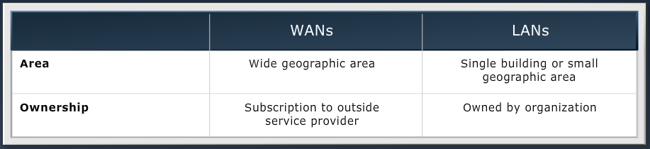
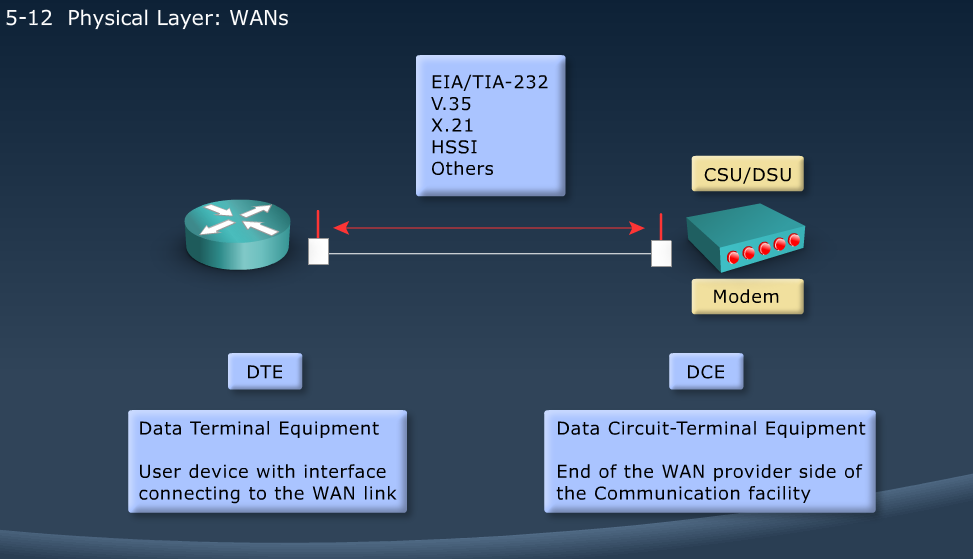
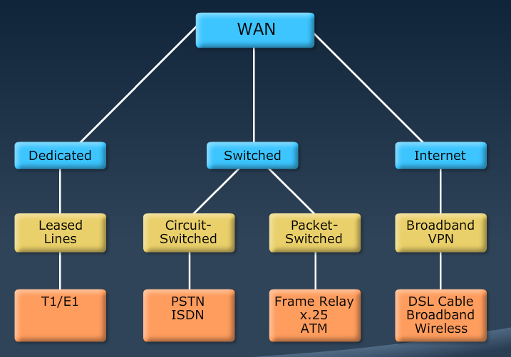
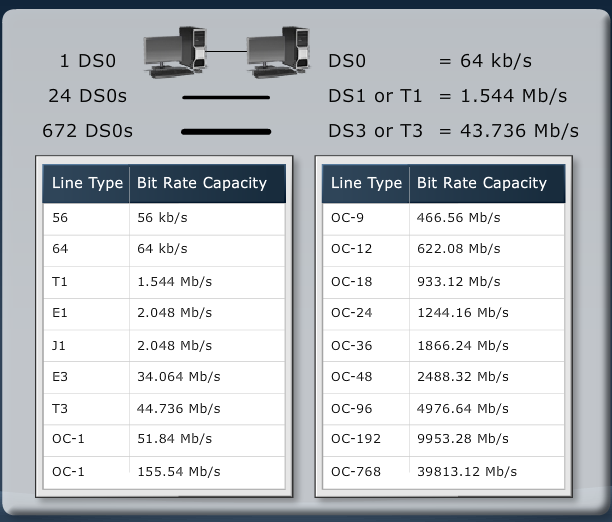

[Router Fundamentals](Cisco4.md)  |  [List](index.html)  |

# WAN Connections
------------------

MODULE 5 LESSION 1
===================

# WAN Technologies

### WAN vs. LAN

## WAN Devices
*	Routers
*	Access Server
	*	Routers that listen w/ modems
*	Modems
	*	dial-up, dsl, cable
*	CSU/DSU
	*	Used to interface w/ T1
*	WAN Switches
*	Core Routers
	*	High end (7000 range model number)
	
## Physical Layer: WANs

*	DTE
	*	Data Terminal Equipment
	*	Normal router
	*	User device with interface connecting to WAN link
*	DCE
	*	Data Circuit-Terminal Equipment (Data Communications Equipment)
	*	Intermediate device
	*	End of WAN provider side of the Communication facility
	*	Controls rate of speed (clockrate)
	*	To the right of the DCE is the leased line (last mile)
	*	CSU/DSU is at the end of the leased line
	
### Serial Point-to-Point Connections

*	End-user device or DTE connects to CSU/DSU or CTE via serial interface
*	Different Serial interfaces on CTE end
	*	EIA/TIA-232
	*	EIA/TIA-449
	*	V.35
	*	X.21
	*	EIA-530
*	Always same connector on DTE side

**Commands**

	terminal length 8
	show controllers serial x/x/x

## WAN Data-Link Protocols

*	WAN Services
	*	Physical Layer:	Electrical, Mechanical, Operational Connections
	*	Frame Relay, ATM, HDLC, Ethernet
	
**Encapsulation:**
*	HDLC - 	High level Data Link Control
*	PPP - 	Point to Point Protocol
*	Frame Relay
*	ATM - 	Asynchronous Transfer Mode
*	Metro Ethernet
*	MPLS - 	Multiprotocol Label Switching

	R1#conf t
	R1(config)#int s0/0/0
	R1(config-if)#encapsulation ?
		frame-relay	Frame Relay networks
		hdlc		Serial HDLC synchronous
		lapb		LAPB (X.25 Level 2)
		ppp			Point-to-Point protocol
		smds		Switched megabit Data Service
		x25			X.25
	R1(config-if)#do show int fa0/0 | include bia
		Hardware is MV96340 Ethernet, address is 0017.e055.b7e8 (bia 0017.e055.b7e8)

## WAN Link Options

### Packet Switching
*	Bandwidth efficiency
*	Identifier on each packet
*	Preconfigured, but non-exclusive, link
	*	Frame Relay

### Circuit Switching
*	Dynamically establishes a dedicated virtual connection.
	*	PPP, HDLC
	
### Public Switched Telephone Network and Considerations
*	Advantages
	*	Simplicity
	*	Availability
*	Disadvantages
	*	Low Data Rates
	*	Relatively long connection setup time

### Leased Line
*	Point-to-Point links use leased lines to provide a dedicated connection.
	*	**Expensive** because you pay for a dedicated line
	
### WAN Connection Bandwidth
*	Available leased-line types and their bit rate capacities
*	

### Last Mile and Long-Range WAN Technologies
*	ISDN
*	DSL
*	Cable
*	Wireless
*	T1
*	Satellite
*	Metro Ethernet
	*	DWDM - 10Gbps link
	*	Makes use of "dark fiber"
*	MPLS

### DSL
*	Technology for delivering high bandwidth over regluar copper lines
*	Uses high transmission frequencies (up to 1MHz)
*	Connection between subscriber and CO

**DSL Service Types**
*	ADSL/SDSL
*	Advantages
	*	Speed
	*	Simultaneous voice and data transmission
	*	Incremental addidions
	*	Always on availability
	*	Backward compatible with analog phones (with filters in place)
*	Disadvantages
	*	Limited availability
	*	Local phone company requirements
	*	Security risks

### Cable-Based WANs
*	Data service runs between cable modem and cable headend
*	Users on a segment share upstream and downstream bandwidth

