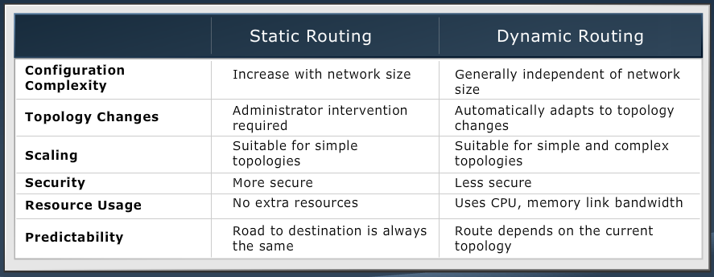
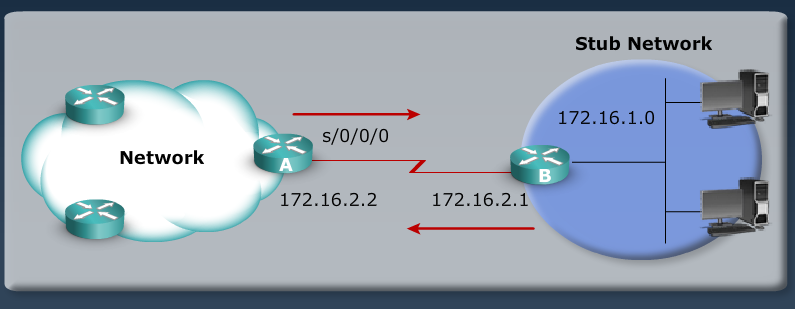
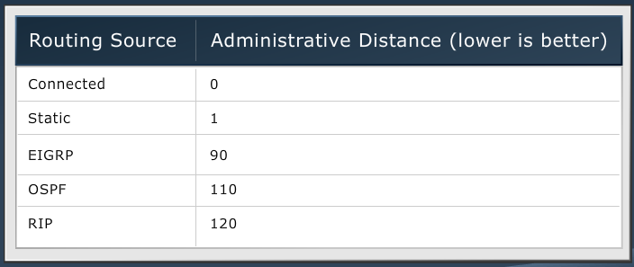
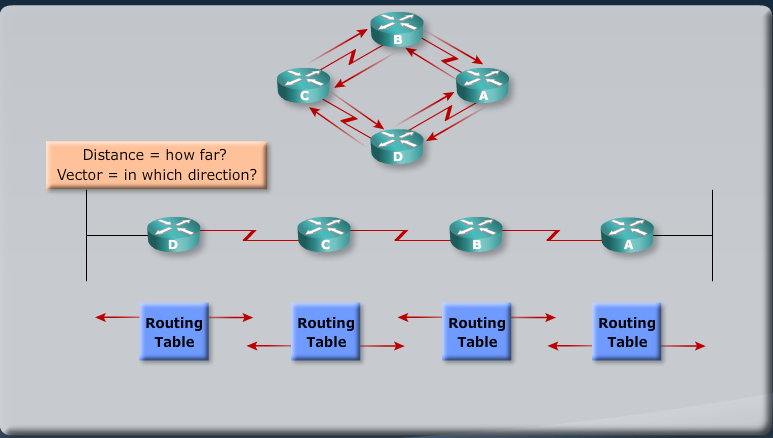
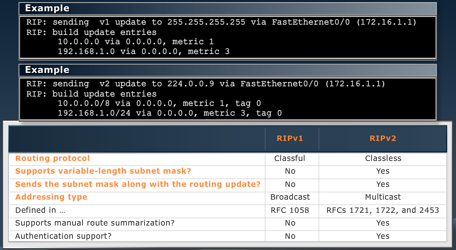
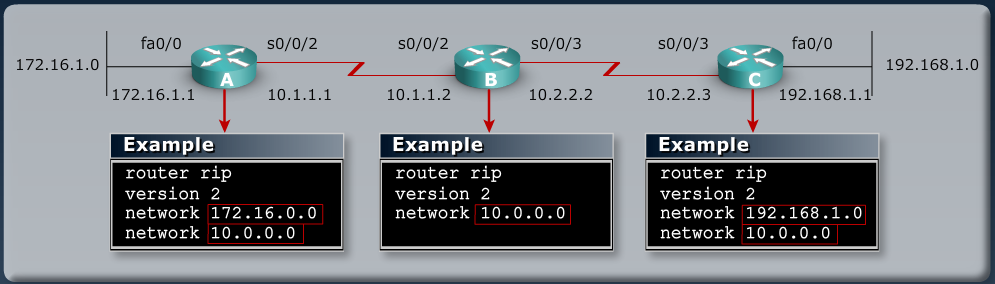

[Router Fundamentals](Cisco4.md)  |  [List](index.html)  | [Network Environment Management](Cisco6.md)

# WAN Connections
------------------

MODULE 5 LESSON 1
===================

# WAN Technologies

### WAN vs. LAN

## WAN Devices
*	Routers
*	Access Server
	*	Routers that listen w/ modems
*	Modems
	*	dial-up, dsl, cable
*	CSU/DSU
	*	Used to interface w/ T1
*	WAN Switches
*	Core Routers
	*	High end (7000 range model number)
	
## Physical Layer: WANs

*	DTE
	*	Data Terminal Equipment
	*	Normal router
	*	User device with interface connecting to WAN link
*	DCE
	*	Data Circuit-Terminal Equipment (Data Communications Equipment)
	*	Intermediate device
	*	End of WAN provider side of the Communication facility
	*	Controls rate of speed (clockrate)
	*	To the right of the DCE is the leased line (last mile)
	*	CSU/DSU is at the end of the leased line
	
### Serial Point-to-Point Connections

*	End-user device or DTE connects to CSU/DSU or CTE via serial interface
*	Different Serial interfaces on CTE end
	*	EIA/TIA-232
	*	EIA/TIA-449
	*	V.35
	*	X.21
	*	EIA-530
*	Always same connector on DTE side

**Commands**

	terminal length 8
	show controllers serial x/x/x

## WAN Data-Link Protocols

*	WAN Services
	*	Physical Layer:	Electrical, Mechanical, Operational Connections
	*	Frame Relay, ATM, HDLC, Ethernet
	
**Encapsulation:**
*	HDLC - 	High level Data Link Control
*	PPP - 	Point to Point Protocol
*	Frame Relay
*	ATM - 	Asynchronous Transfer Mode
*	Metro Ethernet
*	MPLS - 	Multiprotocol Label Switching

	R1#conf t
	R1(config)#int s0/0/0
	R1(config-if)#encapsulation ?
		frame-relay	Frame Relay networks
		hdlc		Serial HDLC synchronous
		lapb		LAPB (X.25 Level 2)
		ppp			Point-to-Point protocol
		smds		Switched megabit Data Service
		x25			X.25
	R1(config-if)#do show int fa0/0 | include bia
		Hardware is MV96340 Ethernet, address is 0017.e055.b7e8 (bia 0017.e055.b7e8)

## WAN Link Options

### Packet Switching
*	Bandwidth efficiency
*	Identifier on each packet
*	Preconfigured, but non-exclusive, link
	*	Frame Relay

### Circuit Switching
*	Dynamically establishes a dedicated virtual connection.
	*	PPP, HDLC
	
### Public Switched Telephone Network and Considerations
*	Advantages
	*	Simplicity
	*	Availability
*	Disadvantages
	*	Low Data Rates
	*	Relatively long connection setup time

### Leased Line
*	Point-to-Point links use leased lines to provide a dedicated connection.
	*	**Expensive** because you pay for a dedicated line
	
### WAN Connection Bandwidth
*	Available leased-line types and their bit rate capacities
*	

### Last Mile and Long-Range WAN Technologies
*	ISDN
*	DSL
*	Cable
*	Wireless
*	T1
*	Satellite
*	Metro Ethernet
	*	DWDM - 10Gbps link
	*	Makes use of "dark fiber"
*	MPLS

### DSL
*	Technology for delivering high bandwidth over regluar copper lines
*	Uses high transmission frequencies (up to 1MHz)
*	Connection between subscriber and CO

**DSL Service Types**

*	ADSL/SDSL
*	Advantages
	*	Speed
	*	Simultaneous voice and data transmission
	*	Incremental addidions
	*	Always on availability
	*	Backward compatible with analog phones (with filters in place)
*	Disadvantages
	*	Limited availability
	*	Local phone company requirements
	*	Security risks

### Cable-Based WANs
*	Data service runs between cable modem and cable headend
*	Users on a segment share upstream and downstream bandwidth

MODULE 5 LESSON 2
===================

# Setting up an Internet Connection

## Internet Interface Address
*	Manually assigned IPs provided by ISP
*	Dynamically assigned IPs 
	*	Router acts as DHCP client
	*	ISP provides IP address through DHCP
	*	Also gets DNS information from ISP's DHCP server

### NAT
*	An IP Address is either local or global
	*	Local addresses are internal
	*	Global are external
	*	NAT assignment can be static or dynamic
	
### Port Address Translation
*	PAT translates multiple local addresses to a single global IP address
*	
*	Only done on routers that are on the border (public/internal) routers

	### Translating Inside Source Addresses

	1.	src = 10.1.1.1
	2.	Sent to router
	3.	Router checks NAT table and sees entry for 10.1.1.1 and translates it to the Inside Global IP of 209.165.200.225
	4.	Router sends out packet with 209.165.200.225 src address
	5.	Responses come back to the Inside Global IP and the router translates back to 10.1.1.1 (inside local ip)

	### Overloading an Inside Global Address

	

**Gathering Required Information**

	Router(config)#int fa0/1
	Router(config-if)#ip address dhcp
	Router(config-if)#ip nat outside
	Router(config)#int fa0.0
	Router(config-if)#ip address 10.4.4.11 255.255.255.0
	Router(config-if)#ip nat inside

## Configuring client wizard in SDM
*	 Interface & Connection
	*	Ethernet LAN, PPPoE, Serial
*	WAN Wizard
	*	Make sure you use the right encapsulation
*	Encapsulation
	*	Choose whether or not to use PPPoE or not
*	Advanced Options
	*	Choose whether or not to use PAT
	*	Choose the interface to be translated
*	Summary
	*	Shows "wrap-up" of options chosen in wizard

**Information commands**

	show dhcp lease - shows router' client dhcp lease
	show ip nat translation - displays active translations
	clear ip nat translation - clear all dynamic address tranlation entries

## Configure PAT

	RouterA>en
	RouterA#sh ip int brief - to see which ip addresses on interfaces
	Interface		IP-Address		OK?	Method	Status					Protocol
	FA 0/0			172.16.20.1		YES	manual	up 						up
	FA 0/1			unassigned		YES	unset	administratively down 	down
	Serial 0/0/0	10.45.90.1		YES	manual	up 						up
	Serial 0/0/1	76.20.1.22		YES	manual	up 						up
	RouterA#conf t
	RouterA(config)#ip nat inside source list 1 interface serial 0/0/1 overload
	RouterA(config)#access-list permit 10.45.0.0 0.0.255.255
	RouterA(config)#int serial 0/0/1
	RouterA(config)#ip nat outside
	RouterA(config)#exit
	RouterA(config)#int serial 0/0/0
	RouterA(config-if)#ip nat inside
	RouterA(config-if)#exit
	RouterA(config)#exit
	RouterA#copy run start

## Configure Static NAT

	RouterA>en
	RouterA#sh ip int brief - to see which ip addresses on interfaces
	Interface		IP-Address		OK?	Method	Status					Protocol
	FA 0/0			172.16.20.1		YES	manual	up 						up
	FA 0/1			unassigned		YES	unset	administratively down 	down
	Serial 0/0/0	10.45.90.1		YES	manual	up 						up
	Serial 0/0/1	76.20.1.22		YES	manual	up 						up
	RouterA#conf t
	RouterA(config)#ip nat inside source static 172.16.20.2 76.20.1.18
	RouterA(config)#ip nat inside source static 172.16.20.3 76.20.1.19
	RouterA(config)#interface serial 0/0/1
	RouterA(config-if)#ip nat outside
	RouterA(config-if)#exit
	RouterA(config)#interface fastethernet 0/1
	RouterA(config-if)#ip nat inside
	RouterA(config-if)#exit
	RouterA(config)#exit
	RouterA#show ip nat translations
	Pro		Inside global	Inside local	Outside local	Outside global
	icmp	76.20.1.22:8	10.45.90.2		150.50.50.1:8	150.50.50.1:8
	---- 	76.20.1.18		172.16.20.2		---   			---
	---- 	76.20.1.19		172.16.20.3		--- 			---
	RouterA#copy run start

MODULE 5 LESSON 3
===================
	
# Configuring Serial Encapsulation

## Configuring Serial Interface

	RouterX(config)#int serial 0/0/0
	RouterX(config-if)#bandwidth 64		#Sets bandwidth for routing protocols to use for path choice and QoS
										#Measured in kbps
										#Default is 1544kbps
	RouterX(config-if)#clockrate 64000	#Measured in bps
										#Needs setting on DCE only
										#Misconfigured can lead to up/down status

### Serial Interface show controller

	RouterX#show controllers serial 0/0/0
	Hardware is PowerQUICC MPC860
	DTE V.35 TX and RX clocks detected
	idb at 0x81081AC4, driver data structure at 0x81084AC0

### Point to Point Considerations

*	PTP link provides a pre-established WAN communications path from the customer premises through the provider network to a remote destination
*	Advantages
	*	Simplicity
	*	Quality
	*	Availibility
*	Disadvantages
	*	Cost
	*	Limited flexibility

## HDLC and Cisco HDLC
*	HDLC specifies an encapsulation method for data on synchronous serial data links
*	Cisco cannot run Standard HDLC, only Cisco HDLC
*	

### Verifying HDLC encapsulation config

	RouterA#sh int serial 0/0/0
	Serial0/0/0 is up, line protocol is up (connected)
		Hardware is HD64570
		Internet address is 10.1.1.1/24
		MTU 1500 bytes, BW 1544 Kbit, DLY 20000 usec,
			reliability 255/255, txload 1/255, rxload 1/255
		Encapsulation HDLC, loopback not set, keepalive set (10 sec)
		Last input never, output never, output hang never
		Last clearing of "show interface" counters never
		Input queue: 0/75/0 (size/max/drops); Total output drops: 0
		Queueing strategy: weighted fair
		Output queue: 0/1000/64/0 (size/max total/threshold/drops)
			Conversations 0/0/256 (active/max active/max total)
			Reserved Conversations 0/0 (allocated/max allocated)
			Available Bandwidth 1158 kilobits/sec
			...

## Connecting Cisco to non-Cisco routers
*	PPP encapsulation is basically only choice

### PPP Overview
*	PPP provides a standard method for transporting datagrams over point-to-point links
*	PPP uses the HDLC protocol for encapsulating
*	PPP supports authentication
*	**Serial interface does not have a mac address and does not arp**

### PPP Layered Architecture
*	PPP can carry packets from several protocol suites using NCP
*	PPP controls the setup of several link options using LCP
	*	LCP Options (ACME)
		*	**A**uthentication
		*	**C**ompression
		*	**M**ultilink
		*	**E**rror Detection
*	

### PPP Encapsulation
	RouterX(config)#int s0/0/0
	RouterX(config-if)#encapsulation ppp

**PPP Configuration Example**

### Verify PPP on Serial

	RouterA#sh int serial 0/0/0
	Serial0/0/0 is up, line protocol is up (connected)
		Hardware is HD64570
		Internet address is 10.1.1.1/24
		MTU 1500 bytes, BW 1544 Kbit, DLY 20000 usec,
			reliability 255/255, txload 1/255, rxload 1/255
		Encapsulation PPP, loopback not set, keepalive set (10 sec)
		LCP Open
		Open: IPCP, CDPCP
		Last input never, output never, output hang never
		Last clearing of "show interface" counters never
		Input queue: 0/75/0 (size/max/drops); Total output drops: 0
		Queueing strategy: weighted fair
		Output queue: 0/1000/64/0 (size/max total/threshold/drops)
			Conversations 0/0/256 (active/max active/max total)
			Reserved Conversations 0/0 (allocated/max allocated)
			Available Bandwidth 48 kilobits/sec
			...

MODULE 5 LESSON 4
===================
# Enabling Static Routing

## Router Operations

**To be able to route, a router must do the following:**

*	Know the destination address
*	Identify the sources from which the router can learn
*	Discover possible routes to the intended destinatino
*	Select the best route
*	Maintain and verify routing information
*	Learn destinations that are not directly connected
	*	The routing table is used to determine the best path to the destination

## Identifying Static & Dynamic Routes

|	Static									|	Dynamic																					|
|-------------------------------------------|:-----------------------------------------------------------------------------------------:|
|	Uses manually entered route				|Uses routes that routing protocol adjusts automatically for topology or traffic changes	|
|	Topology change requires manual update	|Router learns & maintains routes by exchanging routing updates								|
|	Allows precise control over routing		|Routers are able to discover new networks by sharing routing table info					|

### Advantages of static routing
*	Stub networks
*	Security
*	Lower overhead

## Static Routing
*	Configure unidirectional static routes to and from a stub network to allow communicatinos to occur

### Static Route syntax

*	ip route ?
	*	network 	- destination network or subnet
	*	[mask]		- subnet mask
	*	{address	- IP address of next-hop router
	*	interface}	- Name of interface to use to get to destination network
	*	[distance]	- Defines administrative distance
	*	[permanent]	- Specifies that the route will not be removed even if the interface shuts down

### Static Route Configuration
*From diagram above*

*	Define a path to an IP destination network (172.16.1.0 255.255.255.0)
	*	could also define path to subnet or host
*	Use IP address of the next-hop router (172.168.2.1)
*	Or use outbound interface of the local router (serial 0/0/0)

*Syntax: RouterA(config)ip route {destination network ip} {destination mask} {next-hop router}*
*Example: RouterA(config)ip route 172.16.1.0 255.255.255.0 172.16.2.1*
*Example: RouterA(config)ip route 172.16.1.0 255.255.255.0 serial 0/0/0*

### Verifying Static Routes in Routing Table
*	Examine the routing table with the *show ip route* command
	*	Includes network address and subnet mask as well as ip address of next-hop router or exit interface
	*	Denoted with code **S** in the routing table
	*	Routing tables must contain directly connected networks that are used to connect remote networks before static or 
	dynamic routing can be used
	*	Default route denoted by an *

### Default Static Route
	RouterA(config)#ip route 0.0.0.0 0.0.0.0 <next-hop ip address or interface on local router>

MODULE 5 LESSON 5
===================

# Enabling RIP

## What is a Routing Protocol?
*	Routing protocols are used between routers to determine paths and to maintain routing tables
*	After the path is determined, a router can route a routed protocol
	*	Routed Protocols - IPv4, IPv6
	*	Routing Protocols- RIP, EIGRP
	
### Purpose of a Dynamic Routing Protocol
*	Discovery of remote networks
*	Maintaining up-to-date routing information
*	Choosing the best path to destination networks
*	Ability to find a new best path if the current path is no longer available

### Autonomous Systems: Interior and Exterior Routing Protocols
*	An autonomous system is a collectino of networks within a common administrative domain
*	Interior Gateway Protocols (IGP) operate within an autonomous system
*	Exterior Gateway Protocols (EGP) connect different autonomous systems

	RIP 	- Routing Information Protocol
	EIGRP	- Enhanced Interior Gateway Routing Protocol
	OSPF	- Open Shortest Path First
	IS-IS	- Intermediate System to Intermediate System
	BGP		- Border Gateway Protocol

|	IGP	|	EGP	|
|-------|:-----:|
|RIPv2	|BGP	|
|EIGRP	|		|
|OSPF	|		|
|IS-IS	|		|

### Classes of Routing Protocols
*	Distance Vector
	*	RIP
	*	RIPv2
*	Advanced Distance Vector/Hybrid
	*	EIGRP
*	Link State
	*	OSPF
	*	IS-IS

### Routing Decisions
*	Routers may have multiple sources indicating how to reach the same direction
*	A routing table may only possess one source per destination network
*	Therefore, routers must choose the optimal routing source
*	Administrative distance is the mechanism by which routers identify the trustworthiness or believability of a route

### Classful Routing Protocol *Bad Idea*
*	Classful routing protocols do not include the subnet mask with the route advertisement
*	Within the same network, consistency of the subnet masks is assumed. Fixed length subnet masking required when using Classful routing 
protocols
*	Summary routes are exchanged between foreign networks
*	RIPv1 is a classful protocol
	
### Classless Routing Protocols *Less is More*
*	Classless routing protocols include the mask with the route advertisement
*	Classless routing protocols support a variable-length subnet mask (VLSM)
*	Summary routes can be manually controlled within the network
*	Examples of classless RPs:
	*	RIPv2
	*	EIGRP
	*	OSPF
	*	IS-IS
	*	BGP
	
### Distance Vector Protocols
*	Routers pass periodic copies of their routing table to neighboring routers and accumulate distance vectors
*	

### Sources of Information and Discovering Routes
*	Routers discover the best path to destinations from each neighbors routing table
*	Each router maintains its own routing table

### RIP
*	Hop-count metric selects path
*	Routing updates broadcast every 30 seconds
*	Capable of load balancing up to 16 equal cost paths (default = 4)
*	Does not take into account speed/bandwidth **at all**
*	

## IP Routing Configuration Tasks

*	Router configuration
	*	Select routing protocols
	*	Specify networks or interfaces
	*	using network command
	*	**network command enables routing protocol for a specified network**

### RIP Configuration

	Router(config)#router rip					# Start RIP routing process
	Router(config-router)#version 2 			# Enable RIPv2
	Router(config-router)#no auto-summary		# 
	Router(config-router)#network 10.0.0.0		# Enable RIP on all interfaces that belong to 10.0.0.0 network
	Router(config-router)#network 172.16.0.0	# Enable RIP on all interfaces that belong to 172.16.0.0 network
												# Requires a major classful network number

### Verify RIP Config

	Router#show ip protocols
	Routing protocol is "rip"
	Sending updates every 30 seconds, next due in 15 seconds
	Invalid after 180 seconds, hold down 180, flushed after 240
	...
	Routing for networks
	10.0.0.0
	172.16.0.0
	Passive Interface(s):
	Routing Information Sources:
	Gateway			Distance		Last Update
	10.1.1.2			120			00:00:16
	...

	Router#show ip route
	Codes: ... R - RIP ...
	...
	R		10.2.2.0	[120/1]	via 10.1.1.2, 00:00:19, Serial0/0/2
		172.16.0.0/24 is subnetted, 1 subnets
	R		192.168.1.0/24	[120/2]	via 10.1.1.2, 00:00:19, Serial0/0/2

## Lesson 5 Summary
*	The purposes of dynamic routing protocols:
	*	Discovery of remote networks
	*	Maintaining up to date routing information
	*	Choosing the best path to destination networks
	*	Ability to find a new best path if current path is no longer available
*	Classful routing protocols do not send subnet mask information in routing updates. Classless routing protocols include mask with network address in routing updates
*	The periodic routing updates that most distance vector routing protocols generate are addressed only to directly connected routing devices.
*	RIP is a distance vector routing protocol that uses hop count as the metric for determining route selection and broadcasts updates every 30 seconds
*	RIPv1 uses a classful routing protocol, and RIPv2 uses a classless routing protocol.
	*	RIPv2 supports VLSM, manual route summarization, and authentication, while RIPv1 does not support these activities
*	To enable dynamic routing protocols:
	1.	A routing protocol is selected
	2. 	IP network nubers are assigned withoug values being specified (except for OSPF)
	3.	The **router** command starts the routing process
	4. 	The **network** command allows the routing process to determine which interfaces will participate in sending and receiving the routing updates
*	The **router rip** command selects RIP as the routing protocol. The **network** command identifies a participating attached network
*	The **show ip protocols** command displays information about routing protocols and the **show ip route** command displays the routing table
*	The **debug ip rip** command displays information about RIP routing transactions