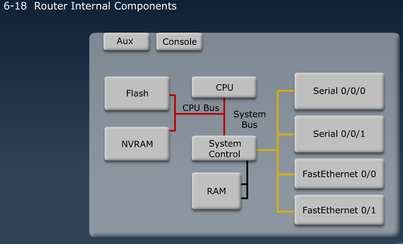
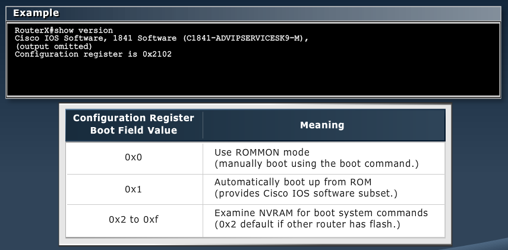
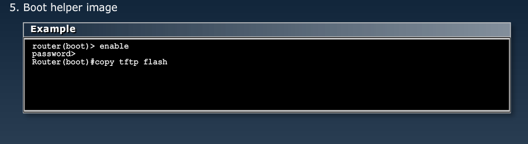

[Router & WAN Config](Cisco5.md)  |  [Home](index.html)

MODULE 6 LESSON 1
==================

# CDP

## Creating a Network Map
**A network topology map is critical in network management**

## Cisco Discovery Protocol
*	CDP is a proprietary utility that gathers information about direct-connected Cisco switches, routers, and other devices
*	CDP discovers neighboring devices, regardless of which protocol suite they are running
*	Physical media must support the SNAP encapsulation
*	LLDP - alternative standards-based discovery protocol
*	Runs on Cisco IOS devices
*	By default, each device sends messages every 60 seconds to directly connected Cisco devices
*	Summary information includes:
	*	Device identifiers
	*	Address list
	*	Port identifier
	*	Capabilities list
	*	Platform

### Using CDP
	Router#show cdp neighbors
	Router#show cdp neighbors detail

### Enabling/Disabling CDP
*Can disable globally or on a specific interface*

	RouterA(config)#no cdp run
	RouterA(config-if)#no cdp enable

	RouterA#show cdp traffic

MODULE 6 LESSON 2
==================

## Internal components
*	CPU - Executes OS instructions
*	RAM - Contains running config, Stores routing table
*	ROM - Holds diagnostic software used on power up, stores bootstrap program
*	NVRAM - Stores startup config
*	Flash Memory - Contains the OS
*	Interfaces - ports - Ethernet/Fast Ethernet/Gigabit, Serial, Management

### Power-On Boot Sequence
1.	ROM			POST					perform post
2.	ROM			Bootstrap				load bootstrap
3.	Flash		Cisco Internetwork OS	Locate & Load OS
4.	TFTP Server	Cisco Internetwork OS	Locate & Load OS
5.	NVRAM		Cisco Internetwork OS	Locate & load config file or enter setup mode
6.	TFTP Server	Cisco Internetwork OS	Locate & load config file or enter setup mode
7.	Console		Cisco Internetwork OS	Locate & load config file or enter setup mode

## Finding IOS Image

1.	Checks configuration register
	*	
2.	Parse config for boot system command
3.	Defaults to first file in flash memory
4.	Attempts boot from network server (TFTP)
5.	Boot helper image
	*	
6.	ROMMON

MODULE 6 LESSON 3
==================

# Managing devices

