[Home](index.html)

# Subnetting
-------------
**Helpful Chart**
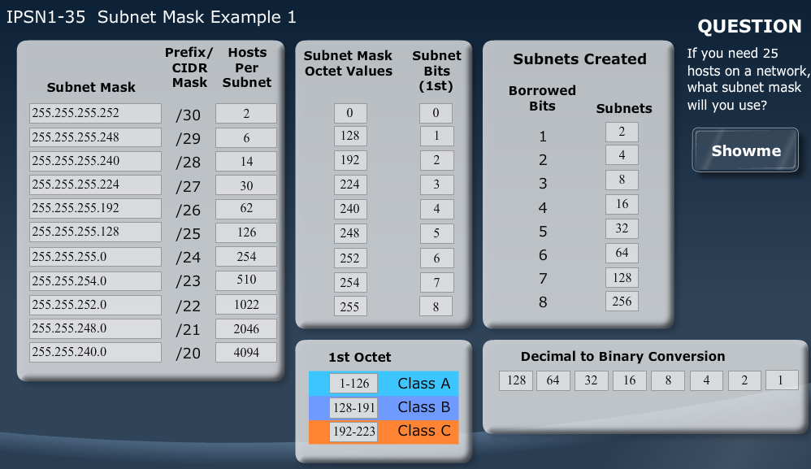

## IPv4 Public Address Depletion

*	The last class A, /8 block of IP Addresses has been allocated as of February 2011
*	The equivalent of 5 public /8 blocks, comprised of collections of Class B and C networks, remain as of 2011
*	Subnetting and NAT are the two most effective means of contending with the scarcity of public IP addresses

### Privately Addresses Enterprises

*	Privately addressing an internetwork without subnetting allows a finite number of classful networks
*	How many unique private IP addresses are there?
	*	10.x.x.x/8		:	1 classful network
	*	172.16.x.x/16	:	16 classful networks
	*	192.168.x.0/24	:	256 classful networks
	*	=273 total classful private networks
	
### Enterprise Addressing Needs

*	Topology in diagram requires 64-350 subnets
	*	31 subnets in core
	*	8 subnets in Internet block
	*	16-250 for VLANs for end users
	*	3-50 for wireless LANs
	*	4-20 for VLANs in data center
*	Variance is mostly dependant on number of VLANs used for end users and servers
*	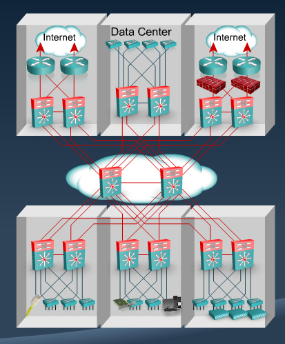

## Classless Addressing

*	Most networks use classless addressing
*	Subnet masks are used to redefine the network portion

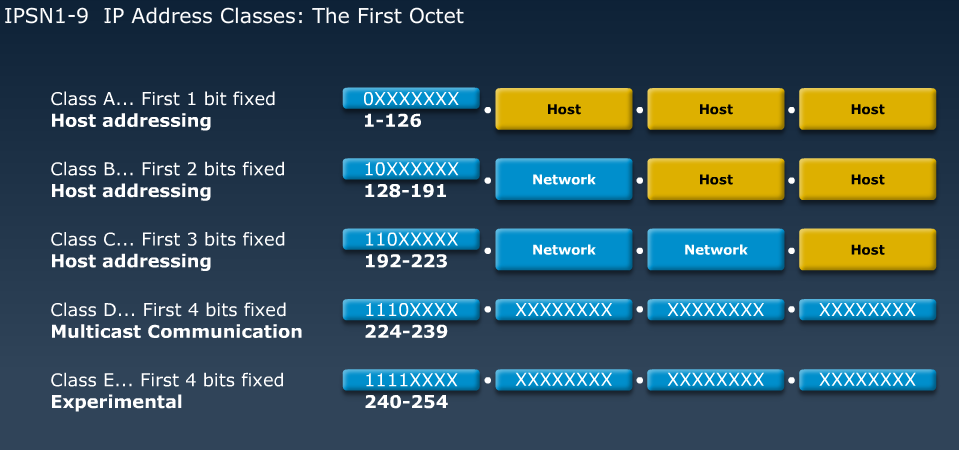

**Host IP Addresses**

*	Each device running TCP/IP stack must have at least one IP address
*	Devices that route must have an IP address for each interface performing routing

## Subnet Mask
*	Any device or host configured with an IP address must possess a mask
*	The purpose of a subnet mask is to indicate the network portion of the IP host
*	All devices in the same IP subnetwork must agree on the subnet mask

### Dotted Decimal Subnet Masks
*	Subnet masks are commonly input as dotted decimal value (255.255.0.0)
*	The mask is used to provide the means of redefining the network and host portions to better use the addresses in a classful network.
	*	Binary 1 in the subnet mask indicates the corresponding bit of the IP address is a "network" bit
	*	Binary 0 in the subnet mask indicates the corresponding bit of the IP address is a "host" bit
	*	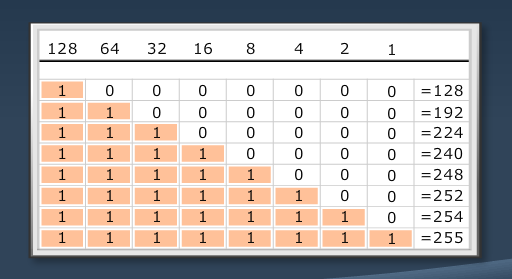
	
### Classful (Natural or Default) Mask
*	Class A - Default mask of 255.0.0.0
*	Class B - Default mask of 255.255.0.0
*	Class C	- Default mask of 255.255.255.0

### IP Addresses in Topologies
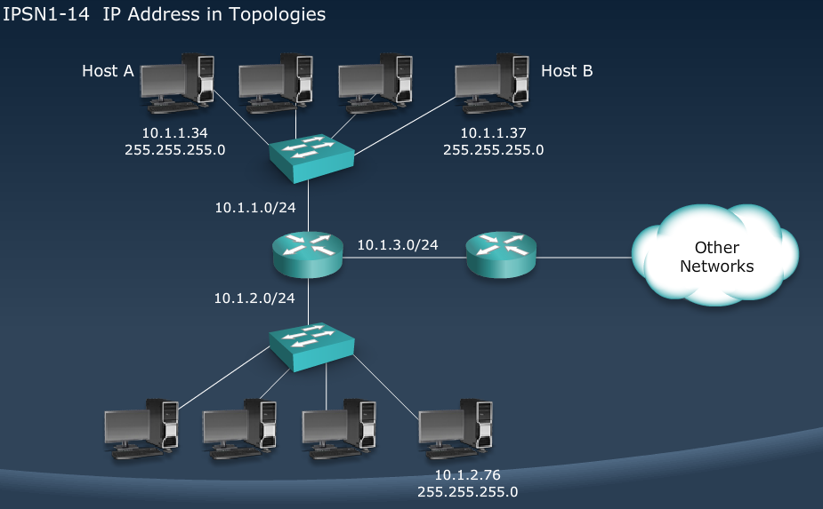

### Prefix notation

**Slash is how many 'network' bits are in the mask**

| 	Subnet Mask		|	Prefix notation	|	Class		|				Binary					|
| ----------------- |:-----------------:|:-------------:|:-------------------------------------:|			
|**255.0.0.0**		|		**/8**		| **A Default**	|**11111111.00000000.00000000.00000000**|
|255.128.0.0		|		/9			|				|11111111.10000000.00000000.00000000	|
|255.192.0.0		|		/10			|				|11111111.11000000.00000000.00000000	|
|255.224.0.0		|		/11			|				|11111111.11100000.00000000.00000000	|
|255.240.0.0		|		/12			|				|11111111.11110000.00000000.00000000	|
|255.248.0.0		|		/13			|				|11111111.11111000.00000000.00000000	|
|255.252.0.0		|		/14			|				|11111111.11111100.00000000.00000000	|
|255.254.0.0		|		/15			|				|11111111.11111110.00000000.00000000	|
|**255.255.0.0**	|		**/16**		| **B Default**	|**11111111.11111111.00000000.00000000**|
|255.255.128.0		|		/17			|				|11111111.11111111.10000000.00000000	|
|255.255.192.0		|		/18			|				|11111111.11111111.11000000.00000000	|
|255.255.224.0		|		/19			|				|11111111.11111111.11100000.00000000	|
|255.255.240.0		|		/20			|				|11111111.11111111.11110000.00000000	|
|255.255.248.0		|		/21			|				|11111111.11111111.11111000.00000000	|
|255.255.252.0		|		/22			|				|11111111.11111111.11111100.00000000	|
|255.255.254.0		|		/23			|				|11111111.11111111.11111110.00000000	|
|**255.255.255.0**	|		**/24**		| **C Default**	|**11111111.11111111.11111111.00000000**|
|255.255.255.128	|		/25			|				|11111111.11111111.11111111.10000000	|
|255.255.255.192	|		/26			|				|11111111.11111111.11111111.11000000	|
|255.255.255.224	|		/27			|				|11111111.11111111.11111111.11100000	|
|255.255.255.240	|		/28			|				|11111111.11111111.11111111.11110000	|
|255.255.255.248	|		/29			|				|11111111.11111111.11111111.11111000	|
|255.255.255.252	|		/30			|				|11111111.11111111.11111111.11111100	|

### Routers separate subnets
*	Routers are very aware of all subnet masks in it's network

## Octet Values
*	To calculate prefix notation, add up number of bits set to 1 in each octet
	*	Every octet of 255 accounts for 8 bits
	*	For octets of 128 through 254, add bit total based on the following chart
*	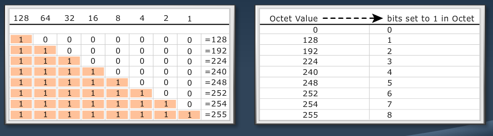

## Subnetting

	Redefines the network by lengthening the default subnet mask for the class
	Extending the network portion allows one classful network to be repurposed as many classless networks

## Borrowed Bits

* 	The number of bits in the mask beyond the default classful mask represents the number of 'borrowed' bits
*	To calculate the number of subnets that a given mask would create first calculate the borrowed bits - S
	*	Borrowed Bits(S) = (custom mask) - (classful mask)
* Example: 
	*	172.16.0.0/16 - Default
	*	172.16.0.0/20 - Custom
	*	4 borrowed bits (/20 - /16)

## Calculating Subnets Created

*	Plug the number of borrowed bits (s) into the following equation
	*	2s = subnets created
*	If a /20 was applied to a class B, you have 4 borrowed bits
	*	24  = 16 subnets created

### Usage of Subnet Zero
*	In modern networking, all subnets can be used
	*	This is why we use 2s instead of 2s - 2 for subnets created
*	Use of all subnets requires all routers support "subnet zero"
*	**All test questions on Cisco exams will either specify usage of subnet zero is allowed or it will be assumed**

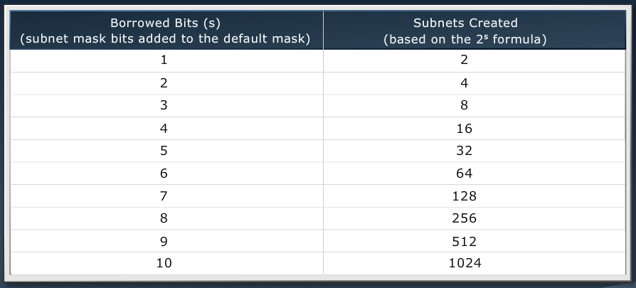

## Drawbacks of Subnetting
*	Fewer hosts can exist in a subnet, than in a classful network
*	Because of less host bits after subnets are broken up

### Typical Subnet sizes
*	How many IPs are practical in a modern network?
	*	Ethernet LANs and VLANs: 254
	*	WLANs:	30-62
	*	Point to Point WANs: 2
	*	Point to Point Ethernet connectivity between routers: 2
	*	Multipoint WANs: 6-30
	*	Publicly addressed servers in a DMZ: 6-254
	
## Hosts per subnet
*	**2h - 2 where h is number of host bits (0s)**
*	**host bits can be determined by subtracting subnet mask in prefix notation from 32**

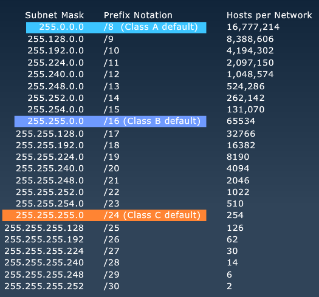

## Calculating Usable Addresses
*	The "-2" of the equation 2h - 2 is needed because each classful network or subnetwork has 2 unusable addresses
	*	the first value is the network or subnet ID
	*	the last value is the directed broadcast
*	No device owns either of these addresses

### The Subnet ID
*	A reference to the network and can be found in the routing table
	*	Network number
	*	Network address
	*	Subnet address
	*	Subnet ID
	*	ip address 10.1.2.1 255.255.255.0
	*	Subnet ID = 10.1.2.0
	
### The Directed Broadcast
*	A means of communicating with all IP hosts on a network
*	Communication to the directed broadcast is disabled by default on most routers because it can be exploited in a "smurf attack"
*	no ip directed-broadcast - disables directed broadcast

## Calculating Subnet IDs
**172.16.0.0/23**
### Usable Range
*	172.16.0.0/23
	*	172.16.0.1-172.16.1.254
*	172.16.2.0/23
	*	172.16.2.1-172.16.3.254
*	172.16.4.0/23
	*	172.16.4.1-172.16.5.254
*	172.16.6.0/23
	*	172.16.6.1-172.16.7.254
	
### Block Size
*	The progression between the subnets is "block size"
*	The block size is "2" in the 3rd octet in the 172.16.0.0/23 example
*	The block size is exclusively based on subnet mask

**Method 1**

*	Find the value of the last bit in set to "1" in the subnet mask
*	The decimal value of the last bit in your subnet mask is the block size
*	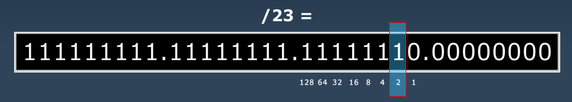

**Method 2**

*	The easiest method is by subtracting the decimal value of the interesting octet from 256
	*	/23 = 255.255.254.0
		*	256 - 254 = 2
	*	/21 = 255.255.248.0
		*	256 - 248 = 8
	*	/10 = 255.192.0.0
		*	256 - 192 = 64

## Addressing a Broadcast Domain

*	Devices that connect over the same WAN or LAN must share the same IP address network portion
*	This network portion must also be unique in teh routing domain and cannot be reused again

-----------------------------

**Binary Analysis of a Class C Address**
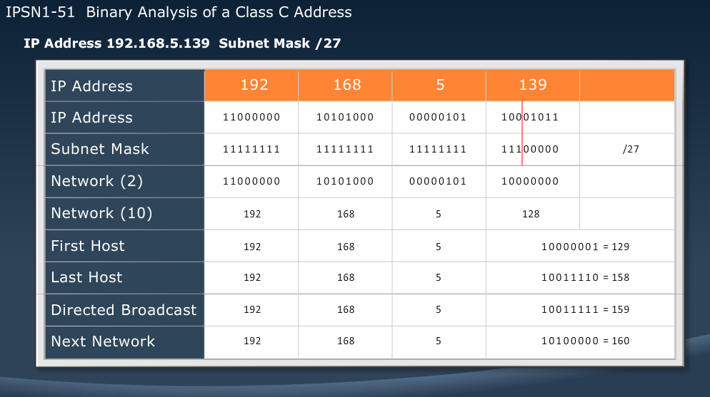

**Binary Analysis of a Class B Address**
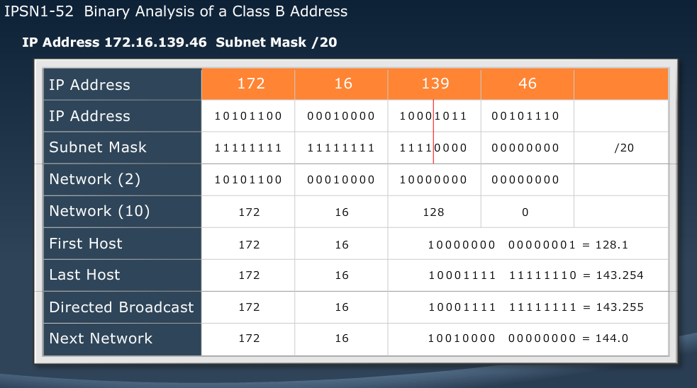

**Binary Analysis of a Class A Address**
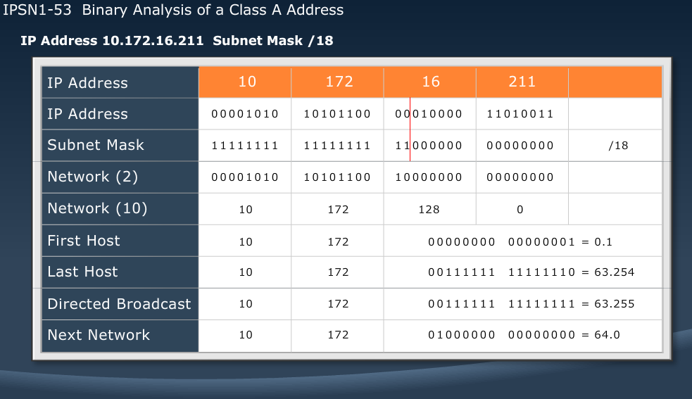